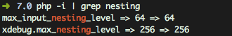

Maximum function nesting level of '256' reached, aborting!函数递归深度超过256

<!--more-->
php本身并没有限制函数递归深度，其实是xdebug扩展报的错

检查php的xdebug配置



修改xdebug配置`
/usr/local/etc/php/7.0/conf.d/ext-xdebug.ini`

```
xdebug.max_nesting_level=512
```


重启 php-fpm,生效

