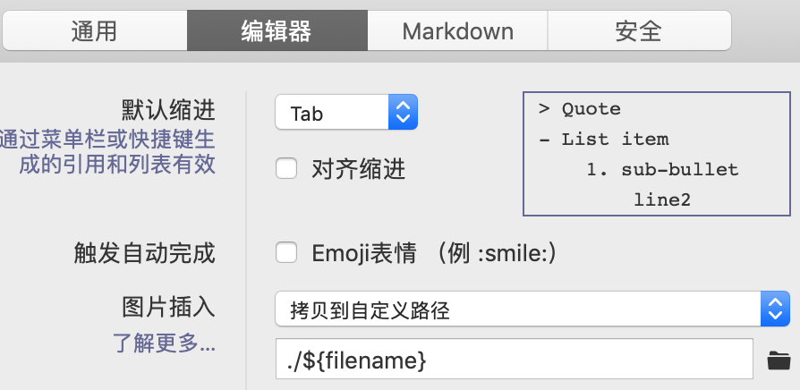

博客的图片不能上传到七牛云了，也懒得去折腾那些在线的图床了，还是放在本地最安心

最近发现了mac上超好用又免费的一款markdown工具`Typora`，`Typora`自带的图片工具可以将本地图片直接复制到md文件中，并放在自定义的路径中，例如与当前md文件同名的文件夹中

这种格式以方便可以被编辑器`Typora`识别并预览

另一方面刚好也是`hexo`支持并可以预览的

于是，就产生了一种比较好的博客实践方式，即`hexo+typora`，详情见正文


<!--more-->

## 将博客中的图片从七牛云中下载到本地

[详见本文](16bh.github.io/batch-download-image-from-qiniu)

## 配置hexo支持本地图片

hexo3的一个新特性，是可以支持本地图片

修改配置文件`*.github.io/_config.yml`

```yml
 post_asset_folder: true
```

这样每次之后，每次新建一篇md博文的时候，都会同时新建一个同名的文件夹用于存储该文章的图片

## 配置typora

按如下方式配置`typora`，这样当你在md文件中插入一张图片的时候，刚好会被`typora`复制到hexo生成的文件文件夹中



如上图，我截图并复制到markdown文件中后，就会被自动替换成下面的路径

```

```

其中,`a-cool-way-to-blog-by-hexo-and-typora`是本文的标题

## tips

有一篇文章指出的一点我觉得很好

图片能省则省，不要滥用图片，占用空间

其他关于hexo的使用，请参考以下文章：[hexo系列](https://16bh.github.io/tags/hexo)
