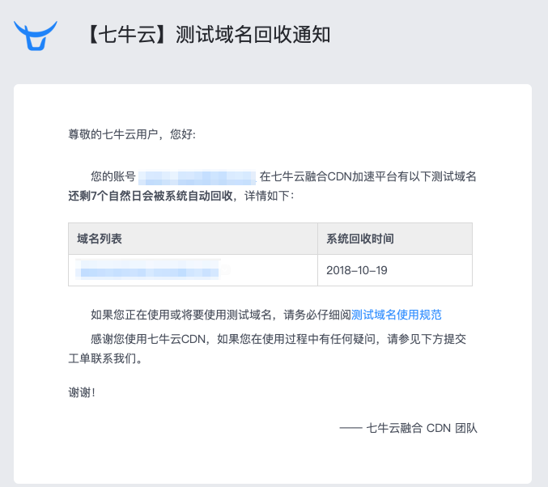
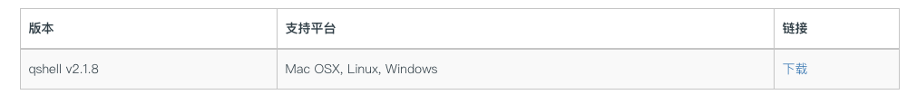

---


title: 七牛测试域名过期后批量下载图片到本地
toc: true
comment: true
date: 2018-10-15 15:24:04
categories: [hexo]
tags:
---


收到邮件，七牛云的测试域名过期了，之前都是免费试用的，看来七牛是发现太多人在白嫖了

博客的图片都是上传到七牛云的域名的

需要迁移出来

<!--more-->




在网上查询了一下，七牛云的网站上是不支持直接下载所有的图片的，需要借助他们的`qshel`l工具来批量下载图片

文档在此：

> https://developer.qiniu.com/kodo/tools/1302/qshell



下载后解压，包含以下文件

```shell
 jim@jims-mac-mini.local  /Users/jim/Downloads/qshell-v2.1.8   ll                                                                                                                                                             18:13:40
total 99824
drwxr-xr-x@   8 jim  staff      256 Oct 15 18:13 .
drwx------+ 102 jim  staff     3264 Oct 15 17:45 ..
-rwxr-xr-x@   1 jim  staff  9119260 Feb  2  2018 qshell-darwin-x64
-rwxr-xr-x@   1 jim  staff  8021196 Feb  4  2018 qshell-linux-arm
-rwxr-xr-x@   1 jim  staff  9215268 Feb  2  2018 qshell-linux-x64
-rwxr-xr-x@   1 jim  staff  7893862 Feb  2  2018 qshell-linux-x86
-rwxr-xr-x@   1 jim  staff  9057792 Feb  2  2018 qshell-windows-x64.exe
-rwxr-xr-x@   1 jim  staff  7790592 Feb  2  2018 qshell-windows-x86.exe
```

我们的系统是mac，所以用其中`qshell-darwin-x64`命令行就可以了，如果是windows系统可以参考上面的文档页面，有详细的操作

1.根据要求将命令行工具需改名称为qshell，并修改权限

```shell
cp qshell-darwin-x64 qshell
chmod +x qshell
```


2. 登录七牛账号，其中AccessKey和SecretKey可以在你的七牛云网站中查到，不赘述

   ```shell
   ./qshell {AccessKey} {SecretKey}
   ```


3. 可以用`buckets`和`domins`命令查看bucket和domin

   ```shell
    jim@jims-mac-mini.local  /Users/jim/Downloads/qshell-v2.1.8   ./qshell buckets                                                                                                                                               17:39:51
   2018/10/15 17:39:53 [I] Load account from /Users/jim/.qshell/account.json
   j***u
   
    jim@jims-mac-mini.local  /Users/jim/Downloads/qshell-v2.1.8   ./qshell domains j***u                                                                                                                                        17:40:09
   2018/10/15 17:40:13 [I] Load account from /Users/jim/.qshell/account.json
   ***.bkt.clouddn.com
   ```

   其中，bucket对应的就是我们的存储空间，也即我们需要下载图片的地方

4. 创建爱你下载配置并下载

   我们通过`qdownload`命令来下载，[该命令的详细用法](https://github.com/qiniu/qshell/blob/master/docs/qdownload.md)

   大概的思路就是创建一个下载配置文件`qdisk_down.conf`，然后指定qdownload命令通过这个配置下载就ok了

随便找个地方创建这个文件，编辑如下：


```conf
{
	"dest_dir"	:	"/Users/***/qiniu",
	"bucket"	:	"j***u",
	"cdn_domain"    :      "***.bkt.clouddn.com"
}
```

这里的bucket和cdn_domain就是我们上面查询得到的玩意儿了

dset_dir是你指定下载的目录，其它的用默认配置就ojbk了

最后运行

```shell
qshell qdownload 10 qdisk_down.conf
```


搞定了


---

ps，如果用的blog是hexo框架的

那么，把下载的图片文件夹重命名为assets，copy到`16bh.github.io/source/_posts`目录，然后找个编辑器批量替换_posts中所有的图片地址，将七牛的前缀修改为assets就ok啦