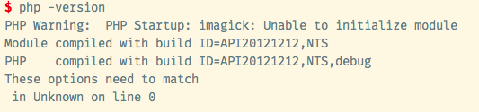
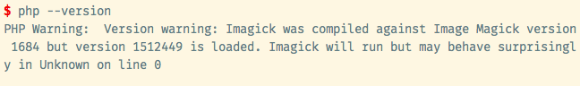
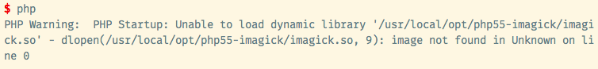
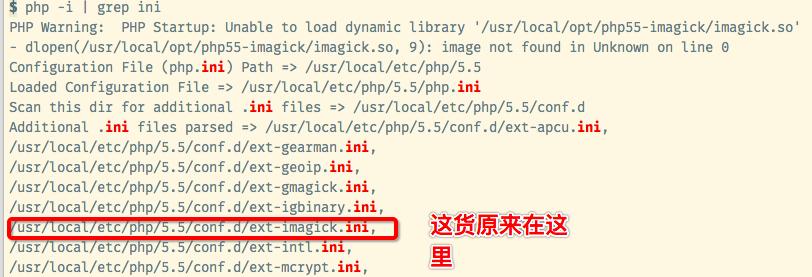
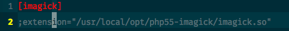

# 背景
>*注：可以直接查看最下面的解决方案*

事情的起因是这样的：
通过下面的命令安装imagic扩展（不要问我为什么装这玩意儿，抽风了可能）

       brew install php55-imagick

运行 `php --version`发现报错信息


>注：此处解决方案参考了这里
https://github.com/Homebrew/homebrew-php/issues/1556

报错原因是因为安装的***imagick扩展与php版本不匹配***，通过下面的命令重新安装
  ```
   brew reinstall php55-imagick --build-from-source
  ```
运行 `php --version`发现新的报错信息


这个原因一直没找到

然后我一想：我管它什么原因，这玩意儿我压根就不需要吧，卸载了就是了
执行
```
brew uninstall php55-imagick
```
果然，又报错了：


在`stackoverflow`上搜索了半天，几乎所有提供的解决方案都是重装`imagick`
but，前面装过了还是会报错啊

先是在`php.ini`文件中看看在哪里启用了imagick这个扩展，并没有发现
>附：`php.ini`的路径是：
`/usr/local/etc/php/5.5`(如果你跟我一样是通过homebrew安装的php的话)

# 最终解决方案
> 注：最后的解决方法参考这里
 http://stackoverflow.com/questions/5282264/php-warning-php-startup-unable-to-load-dynamic-library

先执行下面的命令，获取所有跟php配置相关的文件的路径，终于找到了通过homebrew安装的扩展的位置
```
php -i | grep ini
```



接下来就简单了,打开ext-imagick.ini文件

```
cd /usr/local/etc/php/5.5/conf.d/
vim ext-imagick.ini
```
注销掉`extentions=""`这行就可以了


这下，世界终于安静了，每次启动php的时候静悄悄的，再也没有烦人的warning提示了
