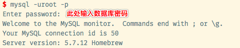
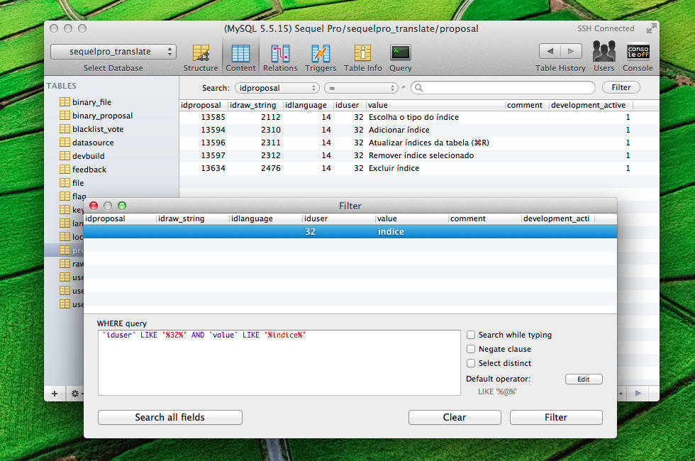

#关于集成环境

如果要使用apache服务器的话，可以考虑windows环境下可以安装集成环境，phpstudy、xampp
mac下也有集成环境：[MAMP](https://www.mamp.info/en/),基础功能不能切换php版本，高级功能收费

另外，mac自带了apache和php，如果对php版本要求不高，线上服务器使用的是apache的话，只需要启用并进行简单的配置，搭配上mysql数据库就拥有一套开发环境了

至于***到底是安装集成环境还是逐项安装***，我的建议是跟线上服务器保持一致：
线上使用nginx，那我们本地就使用nginx,不然远程服务器上的nginx日志都不知道在哪里
线上使用php5，我们也用php5，就不要图新鲜安装php7了（可以在虚拟机里单独搭建一套测试环境，那想装什么样的都ok）

## 一 准备工作
安装homebrew

## 二 安装配置mysql
1. 在终端通过命令行安装
 ```     
brew install mysql
 ```
2. 设置mysql开机启动

  ```
  ln -sfv /usr/local/opt/mysql/*.plist ~/Library/LaunchAgents
  launchctl load ~/Library/LaunchAgents/homebrew.mxcl.mysql.plist
  ```

3.  通过安全方式设置mysql的密码
输入以下命令后
```
 /usr/local/opt/mysql/bin/mysql_secure_installation
```
根据提示输入密码,密码要记住，下面登录的时候要用

4. 登录mysql数据库

  

5. 安装mysql客户端
推荐使用`Sequel`
安装方法：搜索下载安装文件或用命令行下载
```
brew cask install sequel-pro
```

效果图：


#三  安装配置php及php-fpm

  系统自带的php版本不一定能满足我们的需要，一般我们会选择重新安装php，安装的版本应当与线上环境的php版本保持一致。***这样就可以避免本地与线上php版本不一致产生的bug***，比如老版本的一些方法在新版本中已经被淘汰了，而新版本增加了许多实用的功能老版本并不支持
举个小例子：
php5.4之后，可以用`[]`表示数组

``` php
$a = [
    'a' => 1,
    'b' => 2,
];
```


1. 安装php(若要使用系统自带的php可跳过这一步)，以php5.5为例
```
  brew install php55 --with-fpm --with-gmp --with-imap --with-tidy --with-debug --with-mysql --with-libmysql
```

  

2. 安装php扩展，也可以先不急，等后面要用到什么扩展的时候再安装也可以
安装扩展的方法(以xdebug扩展为例)：

```
brew install php55-xdebug --build-from-source;
```

最后的`--build-from-source`是一定要加上的，我看很多教程里都漏了这一句。加上这句可以保证安装的扩展与php版本保持一致

>备注：要卸载通过homebrew安装的php扩展，参考这篇文章：[mac环境下通过homebrew安装的php报错解决](http://www.jianshu.com/p/ef92888fd5f4)

3. 配置环境变量，使我们安装的5.5版本的php覆盖系统自带的php

在文件中写入下面的内容

```
export PATH="$(brew --prefix php55)/bin:$PATH"
export PATH="$(brew --prefix php55)/sbin:$PATH"
export PATH="/usr/local/bin:/usr/local/sbin:$PATH"
```


觉得这样麻烦的，可以直接删除mac自带的老版本的php后再安装

4. php-fpm配置
打开你的php目录，一般在`usr/local/etc/php/5.5`，需要配置`php-fpm.conf`和`php.ini`

5. php-fpm开机启动
```
ln -sfv /usr/local/opt/php55/*.plist ~/Library/LaunchAgents
launchctl load ~/Library/LaunchAgents/homebrew.mxcl.php55.plist
```

## 四 安装配置nginx
1. 安装nginx
```
brew install nginx --with-http_geoip_module
```

2. 启动nginx
```
sudo nginx
```

3. 重新加载配置|重启|停止|退出 nginx
```
nginx -s reload/reopen/stop/quit
```
4. 设置nginx开机启动
```
ln -sfv /usr/local/opt/nginx/*.plist ~/Library/LaunchAgents
launchctl load ~/Library/LaunchAgents/homebrew.mxcl.nginx.plist
```
## 五 配置快捷键
```
alias nginx.start="sudo nginx"
alias fpm.start="sudo php-fpm -D"
alias redis.start="redis-server /usr/local/etc/redis.conf"

alias nginx.stop="sudo nginx -s quit"
alias fpm.stop='sudo pkill php-fpm'
```