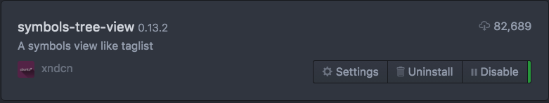
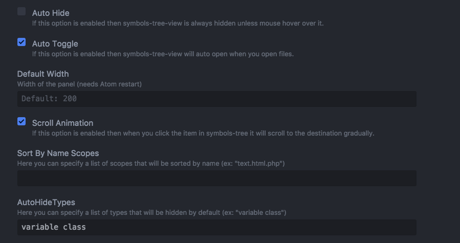
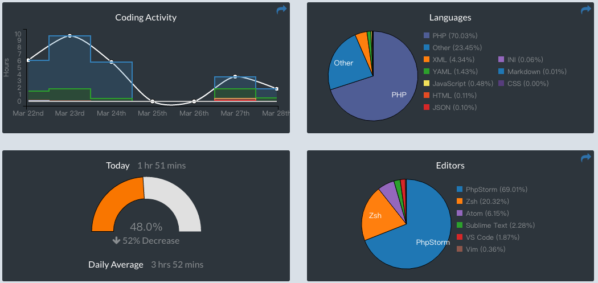

# 特点

1. `atom`一个字形容：酷，搭配`active-power-mode`的爆炸效果码字效果爽的不行；
2. `github`打造，完美支持`git`
3. 插件支持及其丰富，但最好别装太多

---
截止16.7.12还存在以下问题：

1. ~~目前`atom`运行`php`项目时方法跳转不方便，没有sublime好用~~
2. 安装太多的插件后会卡，且无法在插件列表页加载出所有的插件

---
更新：2017年7月21日

又重装了一次，整理了下文章

<!--more-->

# 安装插件
1. 在atom设置界面安装插件

2. 在终端通过apm命令安装插件(推荐)

``` shell
apm    //显示所有命令
apm search package_name    //查找插件
apm install package_name    //安装包
apm uninstall package_name    //卸载包
apm disable package_name    //暂停使用包
apm enable package_name    //激活包
apm list    //查看所有已安装包
```

# apm换用国内源
编辑`~/.atom/.apmrc`文件如下：

```
egistry=https://registry.npm.taobao.org/
strict-ssl=false
```

# 推荐插件方案一

这个方案的插件都是散装的

### 爆炸效果
 activate-power-mode    爆炸效果

### 自动补全
- autocomplete-php    自动补全代码
- autocomplete-paths    自动补全文件路径

### VIM `vim-mode`
 vim-mode && ex-mode    vim插件，ex-mode支持使用命令行

###  函数列表 `symboles-tree-view`
>显示函数列表，点击函数名跳转到代码中对应的位置


如果不设置的话默认会显示类、变量、函数等混在一起的列表，在下面的设置中隐藏掉变量和类



- symboles-view 默认安装，弹窗显示索引列表，无法屏蔽变量名、类名等

###  终端
- terminal-plus
- tokamak-terminal    在atom中使用终端，可设置使用iterm2

### 记录代码习惯  `wakatime`


### 代码错误提示
- `linter`
- `linter-php`

### 代码对齐
- aligner
- aligner-php

### sublimie风格小地图  `minimap`
- minimap    在编辑区域右侧展示sublime风格的小地图
- minimap-find-and-replace 小地图上显示查询结果所在的位置
- minimap-git-diff 小地图上显示git更改

### 美化
- color-picker    颜色拾取
- file-icons    文件标识


# 推荐插件方案二
根据一个老外的博客介绍，可以基于PHP Integrator来安装插件
原文见：[PHP IDE like features for Atom setup](https://medium.com/oneshoe/php-ide-like-features-for-atom-setup-faa0ec2264d6)


 自定义快捷键：

```
'atom-text-editor':
    'cmd-left': 'symbols-view:return-from-declaration'
    'cmd-right': 'symbols-view:go-to-declaration'
```

# 注意事项
1. atom单击临时打开文件，双击固定打开文件；

# 注释
用代码片段（Snippets）注释文件
Atom - Snippets


