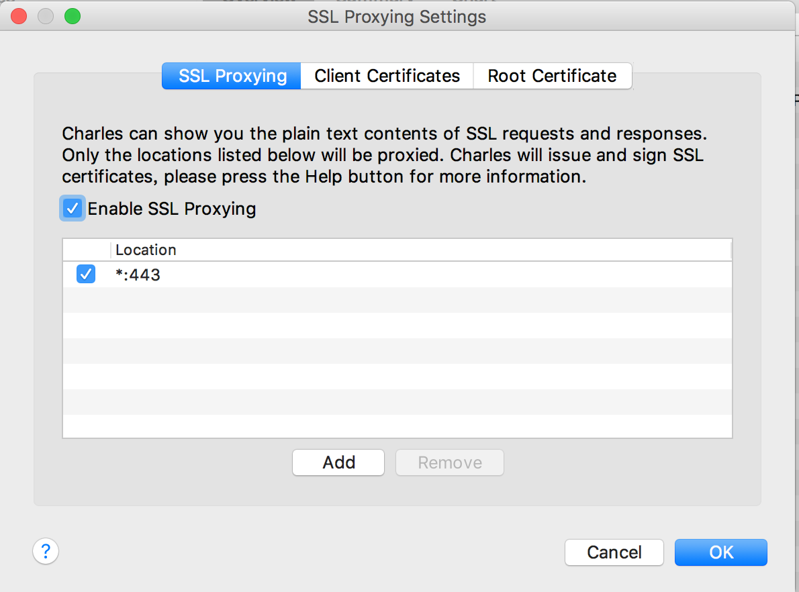
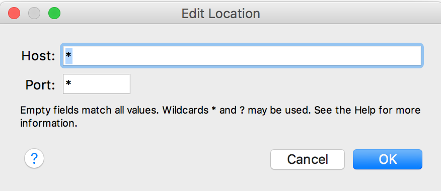
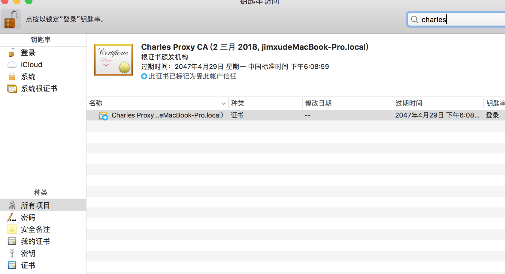
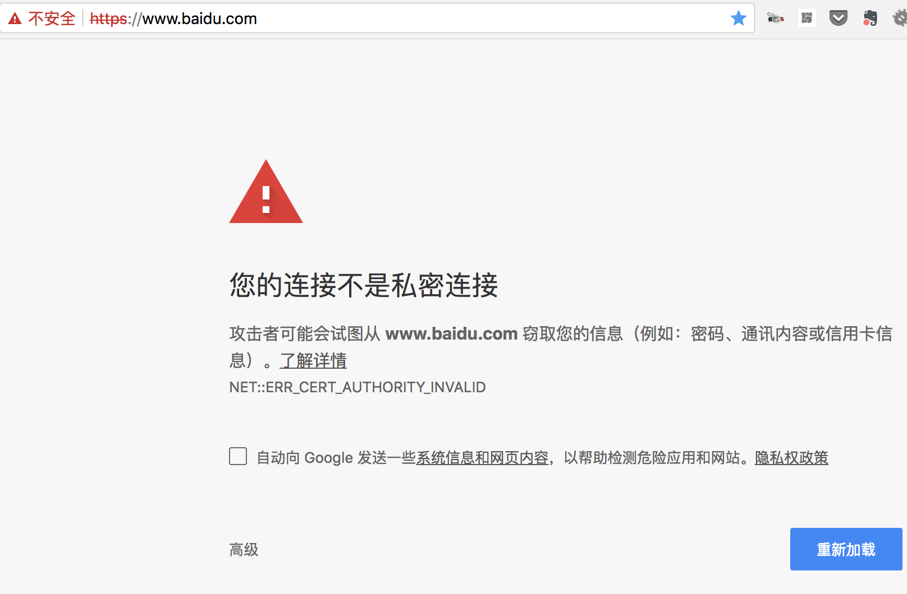

安装好charles之后，设置以支持https抓包。

<!--more-->

## 第一步  设置ssl proxying

`Proxy/SSL Proxying Settings`

将Host和Port都设置为*，就可以抓取所有的https请求

## 第二步 安装证书

`Help/SSL Proxying/Install Charles Root Certificate`

点击后，会安装到钥匙串中

在所有项目中搜索`charles`，选中证书，双击打开，将信任设置为“始终信任”

如果不安装证书，访问https网站时会报错“您的连不是私密连接”

## 手机抓包

设置wifi的代理并访问[chls.pro/ssl](chls.pro/ssl)下载证书到手机上即可

> tips:在安卓模拟器上也可以抓包
