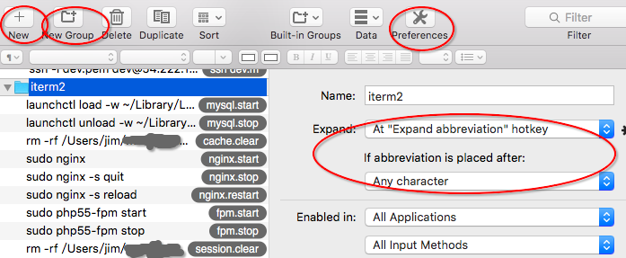
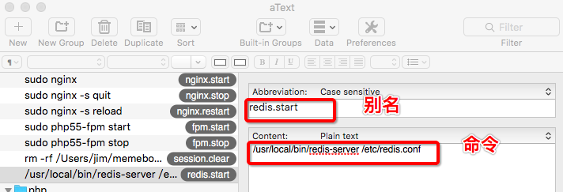

本文介绍两种在mac下快捷输入长命令行的方法
以启动redis服务的命令`/usr/local/bin/redis-server /etc/redis.conf`为例


# 方法一： alias
```shell
cd ~  //进入用户目录
vim .zshrc  //如果安装了zsh的话，打开这个配置，否则使用 vim .bash_profile
//编辑配置文件
alias redis.start="/usr/local/bin/redis-server /etc/redis.conf"//注意，等号左右不能有空格
//完成编辑
source .zshrc  //保存配置，同理，未安装zsh的使用 source .bash_profile
```
这样，别名就设置好了
直接在终端使用`redis.start`就可以启动你的`redis`服务了
*甚至，你还可以将多个alias结合起来使用（见文末）*

# 方法二：atext
>注：也可以使用其他类似的软件，如`TextExpander`

***1.下载并安装`atext`***
  略

***2.atext设置 ***
先在偏好设置里设置触发片段的热键，如ctrl+\
然后打开atext，新建一个片段组`New Group`，并如下图所示设置组的属性
  
这样设置之后，我们输入片段+热键就能触发命令，展开片段对应的内容

***3.编辑常用命令***
如图所示，在组下面新建常用的片段

***4.使用***
这时候，在终端输入设置好的片段名称，如`redis.start`，再按设置好的热键，如 ctrl+\ ,就会自动展开成`/usr/local/bin/redis-server /etc/redis.conf`
，按`return`即可使用该命令了

# 两种方法的比较
第一种alias的方法比较快捷，不用再输入热键，可以可以将多个alias组合起来使用，如：
```shell
alias fpm.start="sudo php55-fpm start"
alias fpm.stop="sudo php55-fpm stop"
alias fpm.restart='fpm.stop && fpm.start'

```
局限性：只能在自己的终端上使用，不能在别的地方用，只能给命令行设置别名

第二种`atext`的使用范围很广，不但可以在自己的终端上使用，还可以在远程服务的终端上使用，还可以记录常用的代码片段，在coding的时候使用（***话说最后才是`atext`最常用的功能吧：）- 来自本人的吐槽***）
