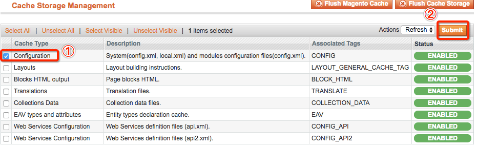

## 手动删除
直接删除文件夹：`项目根目录/var/cache`(需要先暂停`nginx`服务)
## 终端删除缓存
在终端删除的命令行：

``` shell
rm -rf 项目根目录/var/cache
```

可以建立别名，后面快捷删除

``` shell
vim ~/.zshrc
alias cache.clear="rm -rf 项目根目录/var/cache"
source ~/.zshrc
```

注意：如果没有安装过`oh my zsh`，那么需要将上面命令中的` .zshrc `换成 `.bash_profile`
建立别名后，直接在终端输入

``` shell
cache.clear
```

即可清缓存

## 后台删除缓存
进入后台，选择`System` > `Cache Management`

其中`Configuration`表示配置文件，如`local.xml`、`config.xml`的缓存




## 清除redis缓存

当magento接入redis之后，清除redis的缓存会清除magento的所有缓存，清除方法

``` shell
>redis-cli
FLUSHALL
```

>注：最好不要这样做，会清除产品、列表、fpc以及其它所有缓存

