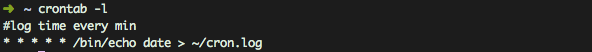
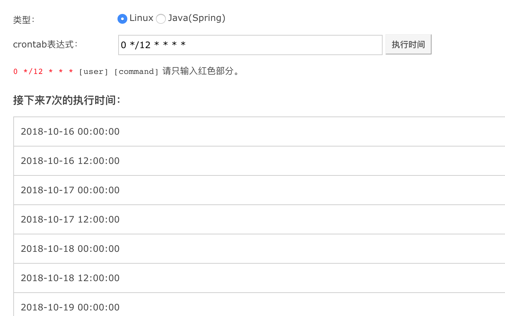

crontab用来定时执行脚本

为什么要定时执行脚本：

- 异步处理，如下单赠品，计算用户会员等
- 自动化，如整点时间让用户可以签到，凌晨五点恢复游戏内体力等。


<!--more-->

## crontab文件格式

```
分钟 小时 日 月 星期 [command]
```
一条crontab执行的shell脚本分为6部分

1. 分钟,默认*
2. 小时,默认*
3. 日,默认*
4. 月,默认*
5. 星期,默认*
6. 命令

前面五个部分用于指定脚本的执行时间和频率，默认`* * * * *`代表每分钟执行一次


```
//输入精确时间
3 * * * * do_sth	   //每3分钟执行一次
//输入范围
* 5-23 * * * do_sth   //从凌晨5点到晚上11点每分钟执行一次（普通人作息时间）
//输入可选项
* * * * 6,7          //在周六和周日每分钟执行一次

```

## 启用cron

新建一个cron文件 `$HOME/jimcron`
编辑如下：

```
#log time every min
* * * * * /bin/echo date > ~/cron.log
```

然后执行下面的命令启用cron

```
crontab $HOME/jimcron
```

## 查看所有cron
```
crontab -l
```



## cron备份与恢复

```
crontab -l > $HOME/jimcron  //备份cron
crontab $HOME/jimcron	//恢复cron
```

## 编辑当前用户的cron

```
crontab -e
```

## 删除cron文件

```
crontab -r
```

## ubuntu下cron命令
```
sudo /etc/init.d/cron start	//启动
sudo /etc/init.d/cron stop 	//关闭
sudo /etc/init.d/cron restart		//重启
```

## crontab模拟工具

https://tool.lu/crontab



