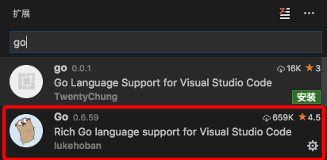
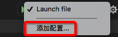
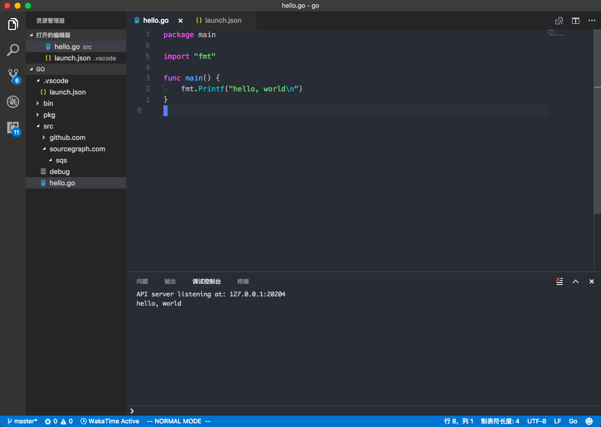

用vsc开发go。

<!--more-->

# 安装Go插件


# 修改配置
`command+,`打开偏好设置

```
"go.gopath": "/Users/{user_name}/go",
"go.goroot": "/usr/local/opt/go/libexec"
```

# 安装 golang debug 插件 delve
```
brew install go-delve/delve/delve
```

>否则使用vscode的调试功能的时候会报错：
Failed to continue: "Cannot find Delve debugger. Install from https://github.com/derekparker/delve & ensure it is in your "GOPATH/bin" or "PATH"."

# 安装依赖
当vocode提示缺少以下依赖的时候，选择安装
若安装失败，在终端运行对应的命令
``` shell
go get -u -v github.com/nsf/gocode
go get -u -v github.com/rogpeppe/godef
go get -u -v github.com/golang/lint/golint
go get -u -v github.com/lukehoban/go-outline
go get -u -v sourcegraph.com/sqs/goreturns
go get -u -v golang.org/x/tools/cmd/gorename
go get -u -v github.com/tpng/gopkgs
go get -u -v github.com/newhook/go-symbols
go get -u -v golang.org/x/tools/cmd/guru
```

# 调试
`调试 - 添加配置`


修改`program`为文件路径

``` json /Users/jim/Documents/code/go/.vscode/launch.json
{
    "version": "0.2.0",
    "configurations": [
        {
            "name": "Launch file",
            "type": "go",
            "request": "launch",
            "mode": "debug",
            "program": "/Users/jim/go"
        }
    ],
    "compounds": []
}
```

开始调试：




