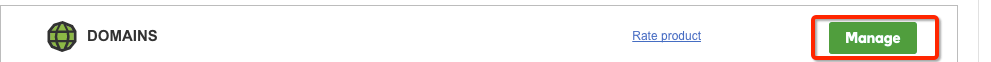
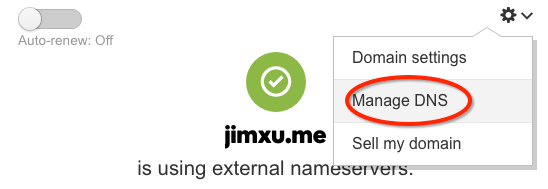
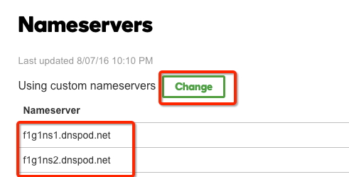
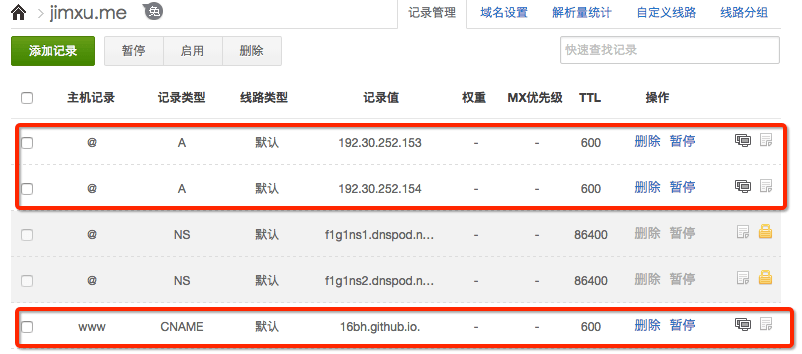
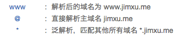

---

title: hexo绑定DNSPOD代理的狗爹域名
toc: true
date: 2016-07-08 22:42:40
categorie: hexo
tags:
---

在godday上购买域名的一次体验

<!--more-->

# 购买域名

在[狗爹](https://au.godaddy.com/)上购买域名,已有域名的可忽略
然后修改成国内的DNS代理

`VISIT MY ACCOUNT`

管理域名：


管理DNS：


<!--more-->

选择第二项`Nameservers`,修改代理地址为`f1g1ns1.dnspod.net`和`f1g1ns2.dnspod.net`


设置完成


# 设置DNSPOD代理
去[DNS](https://www.dnspod.cn/)注册账号后登陆


`域名解析`>`添加域名`>`添加记录`

如图所示，需要加入以下三条记录

```
@        A        192.30.252.153
@        A        192.30.252.154
www      CNAME    your_github_username.github.io.
```
> 注意，当不需要使用github pages的时候 要将这三条都暂停



将`jimxu.me`指向`github page`的ip地址,记录类型为`A`
将`www.jimxu.me`指向`16bh.github.io`，记录类型为`CNAME`


# 设置hexo

编辑`hexo/source/CNAME`,在文件中写入域名


```
jimxu.me
```

编辑配置文件`hexo/_fonfig.yml`


``` yml
url: http://jimxu.me
```

> 当想把域名切换回`github.io`的时候，要把这里改回去

