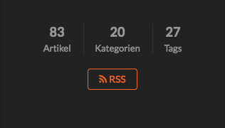
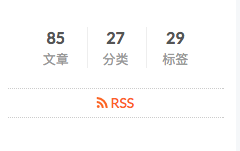
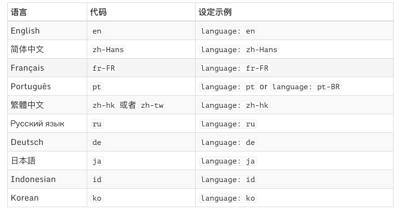

修改了hexo的language没有生效，可能是你没有执行`hexo clean`！

<!--more-->

在Hexo的`站点配置文件`中设置如下
```
language: zh-Hans
```

如下图所示
网站中显示如下，很明显不是简体中文



解决方法：

1. 先将language设置为空
2. 执行`hexo g`
3. 执行`hexo clean`
4. 将language设置为想要的语言
5. 执行`hexo g`


执行上述操作后如下：




>注：
其他语言代码如下：

