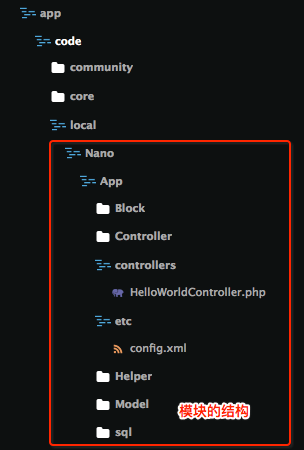
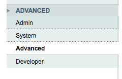
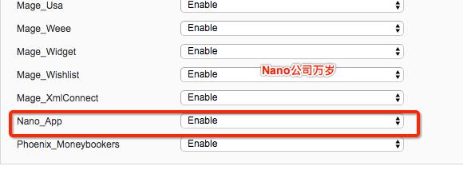

>模块是magento的基本功能单位
因为业务的需求而新增一个模块是常见的需求，网上也有很多的教程，推荐《深入理解magento第二章》


一切的开始

首先，成立一个公司，就叫`Nano`吧（- - 说到底不过是为了存放模块用的吧）
然后，就建立一个`app`的模块好了，一个好的公司怎么能没有`app`应用呢


模块的结构

按如下路径建立文件夹和文件：



其中，
 - local是本地模块的路径
 - Nano是模块的名字空间，一般是公司名
 - App是建立的模块名称，一般以它的功能进行命名
 - App目录下的是一个模块

# 修改模块配置文件
编辑模块的配置文件`Nano/App/etc/config.xml`

``` xml
<?xml version="1.0"?>
<config>
    <modules>
        <Nano_App><!--模块的名字空间与模块名称用下划线分隔开-->
            <version>0.0.1</version><!--配置文件的版本号是0.0.1，后面进行数据库操作的时候，修改数据库就要将版本号递增一次-->
        </Nano_App>
    </modules>
</config>
```

#激活模块
在`app/etc/modules`中新增`Nano_App.xml`并编辑:

``` xml
<?xml version="1.0"?>
<config>
    <modules>
        <Nano_App><!--模块的名字空间与模块名称用下划线分隔开-->
            <active>true</active><!--模块的激活状态，若为false，则模块未启用-->
            <codePool>local</codePool><!--模块的位置属性，分为核心core、社区community、本地local-->
        </Nano_App>
    </modules>
</config>
```

# 查看模块是否新增成功
先清除`magento`的缓存，使得上述配置文件生效

然后访问`magento`后台`localhost/magento/admin`，如果已经登录后台了，那么可能需要退出登录重新登录后台
选择`System/Configuration`
然后在左边的菜单栏选择`Advanced`


在右侧展示的是所有模块



如果能在列表中找到刚建立的模块 `Tecent_App`,那么就说明模块新建成功了
