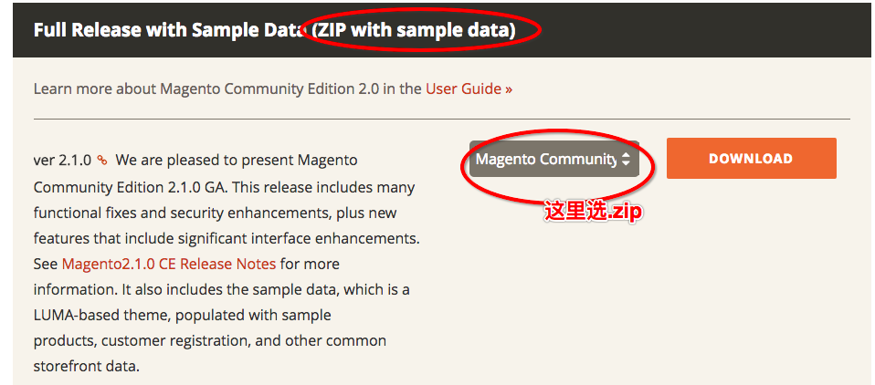
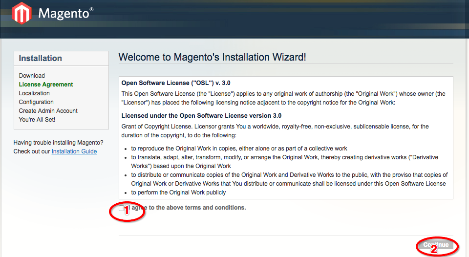
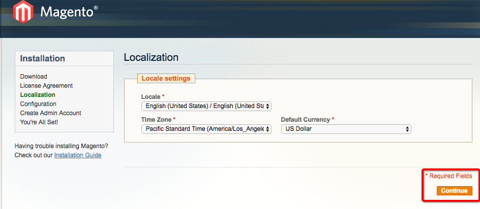
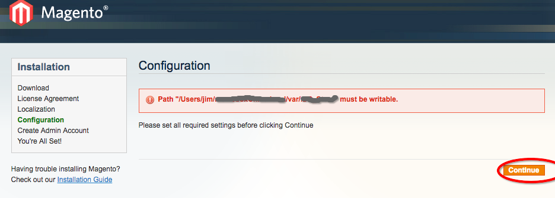

# 准备工作
1. 搭建开发环境：nginx(apache)+php+php-fpm+mysql
2. 在mysql中新建magento要用的数据库

3. 注册[magento](https://magento.com)官网账号，并下载magento
https://magento.com


选择社区版，在打开的页面点`Download Now`


选择带sample data的版本（即测试数据，不然安装好了啥都没有，要自己从头弄起，安装好了）

下载完成后解压到本地根目录，文件夹名称修改成你的项目名称，如'jimPractiseMagento',即可以通过`localhost`访问到的目录

# 安装mageno
访问`localhost/jimPractiseMagento`会自动跳转到安装页面

第一步，【用户协议】，勾选`agree`，选择`continue`



第二步，【语言】， 选择`continue`



第三步，【检测问题】一般出问题的都在这一步

常见的错误有两种：
> 1. 缺乏`php`扩展
> 2. 文件路径不可写，如下图所示




缺乏php扩展的时候，根据提示安装对应的扩展即可

如果像图示一样提示：`xxx/media`或`xxx/var`路径不可写的时候，执行下面的命令***修改根目录的文件权限***

``` shell
chmod -R 777 文件根目录路径
```

>注：修改权限以后，`git`可能会将改了权限的文件视为一种修改，并出现在`sourceTree`的未暂存文件中，这里就需要修改git的配置

``` shell
cd 项目根目录
vim .git/config
```

将.git/config文件中的`filemode = true`改为`filemode = false`即可

解决页面提示的错误后刷新下页面，没有错误后点`continue`

第四步，【数据库】，填写数据库信息后，点`continue`，安装完成
（这里比较简单，故略去）