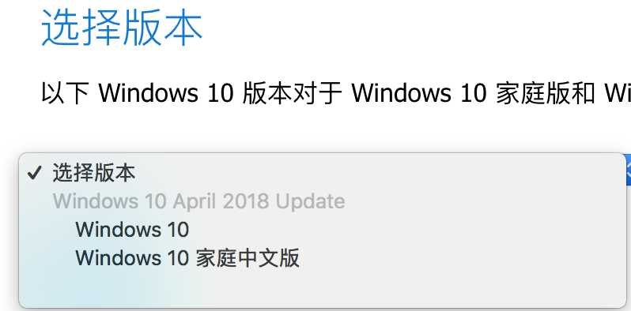
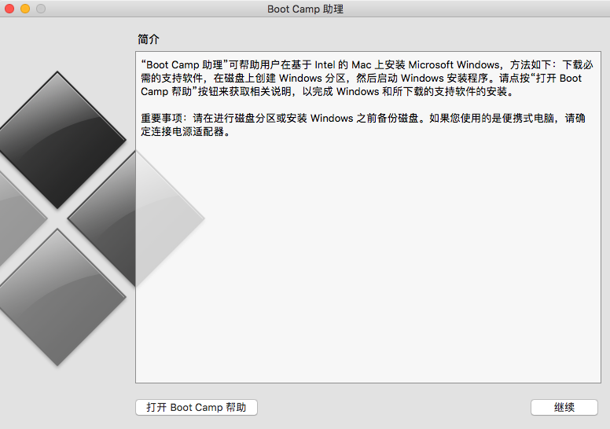
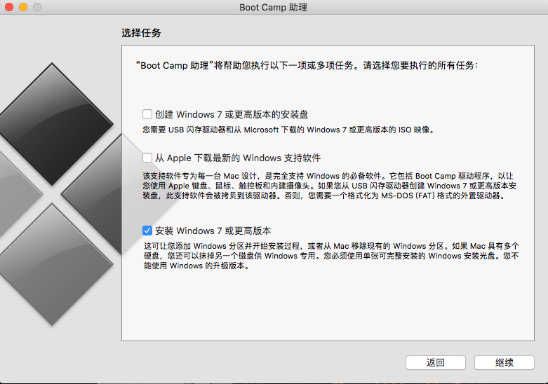

[如何在 Mac 上通过“启动转换”安装 Windows](https://support.apple.com/zh-cn/HT201468)

<!--more-->

1.准备一个U盘，插到电脑上

> U盘会被格式化

2.[下载Windows镜像文件](https://www.microsoft.com/zh-cn/software-download/windows10ISO)，

选择版本

选择语言

选择64位

3.运行MAC自带的软件 Boot Camp 助理

> 软件在应用程序的实用工具里

3.1 打开助手界面,点继续

3.2 选择任务，如果不需要

