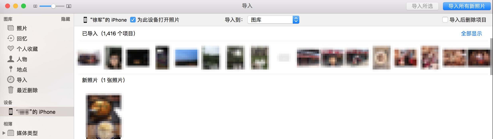
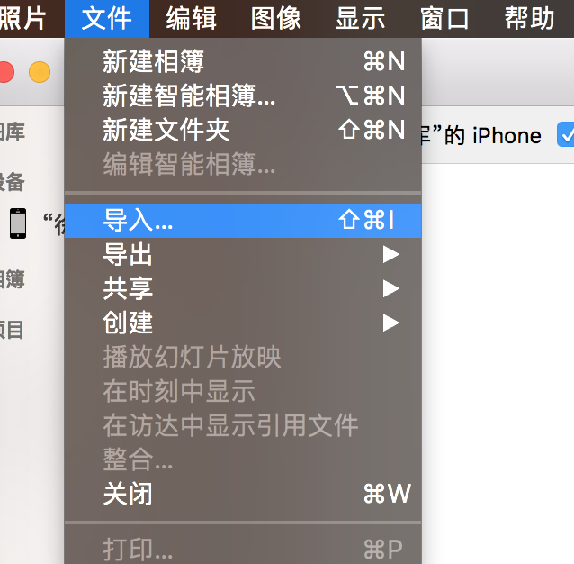
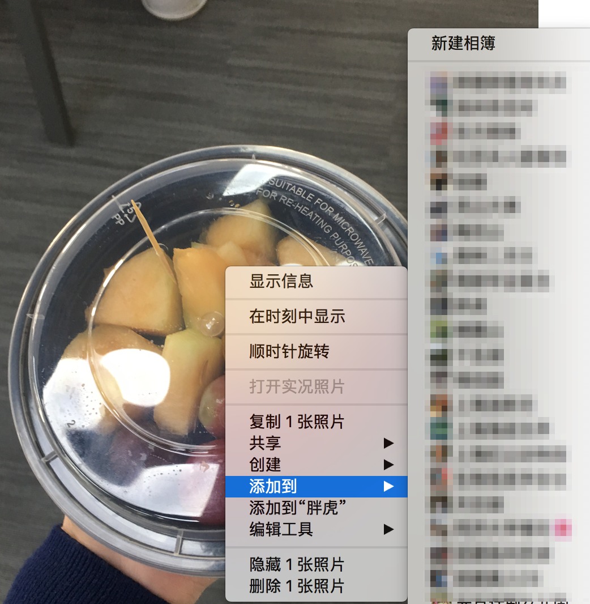
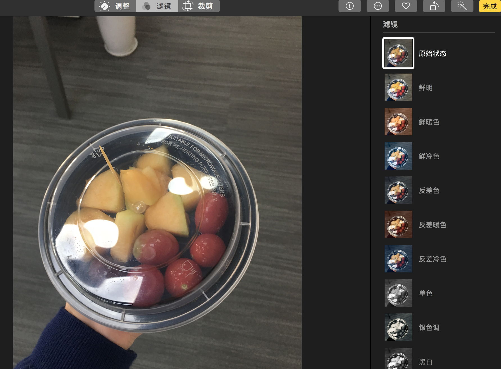

1. 从iphone导入照片
2. 从其他地方导入
3. 照片的整理

<!--more-->

# 从iphone导入照片

1. 用数据线连接你的iphone和mac
2. 解锁iphone
3. 打开Photos
4. 左侧设备一栏会出现你的手机，点击后，会出现你手机上所有的照片，上面是已导入的，下面是未导入的新照片，可以选择右上角的`导入所有新照片`导入全部，也可以勾选想要导入的照片再导入

注意：
（1）右上角有个选项叫`导入后删除项目`，若勾选这一项，会将手机中的照片删掉
（2）导入之后，在Photos软件中修改或删除照片，不会影响手机中存储的照片
（3）导入的时候可以指定某个相簿，若未指定，则导入到`照片`中

# 从其他地方导入

安卓手机或下载到某个文件夹中的照片也可以导入Photos中
选择`文件/导入`，选择照片存储的文件夹，之后的导入方式跟从iphone中导入完全一致。不需要导入重复的照片，软件会将重复的照片自动识别为已导入的

# 照片的整理

## 加入相册

右击某张照片，选择`添加到/新建相册（或某个已存在的相册）`

之后可以在左侧的`相簿/我的相簿`中查看

## 编辑
再带编辑功能，可以进行`调整`或`滤镜`或`裁剪`操作

