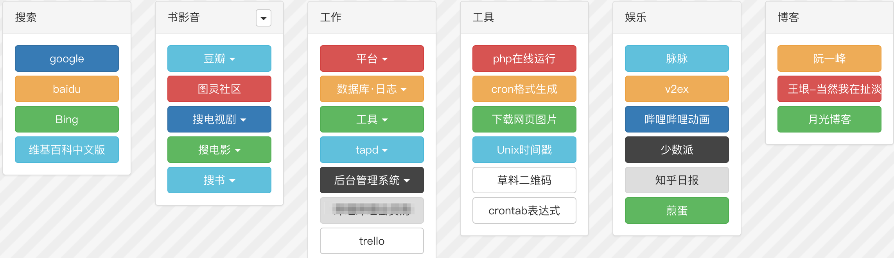
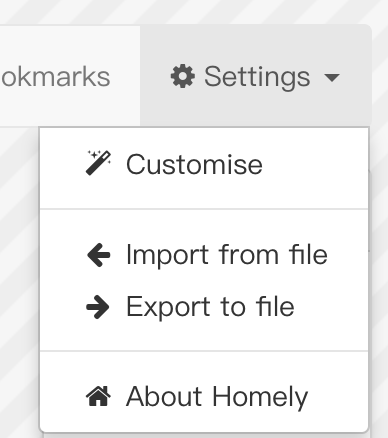
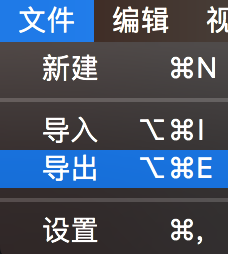
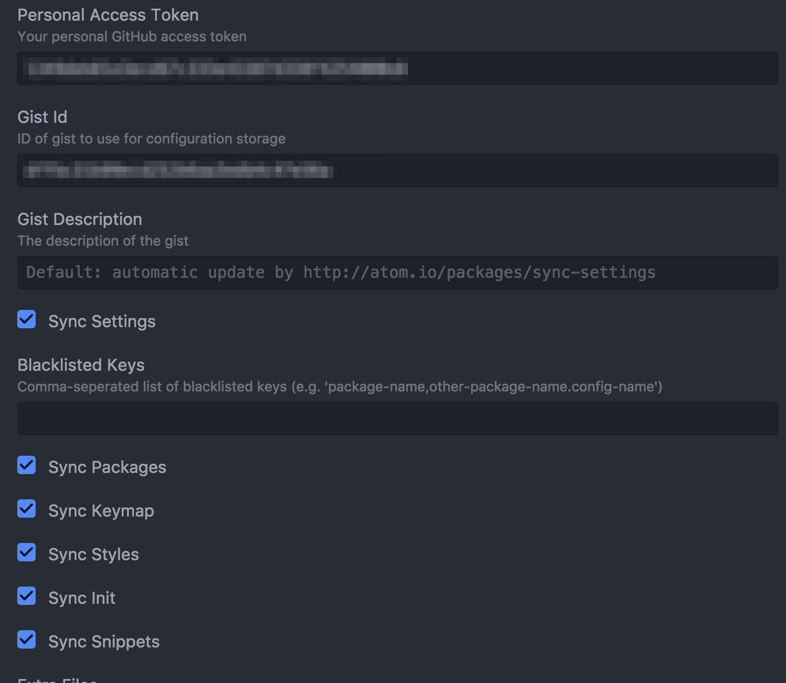
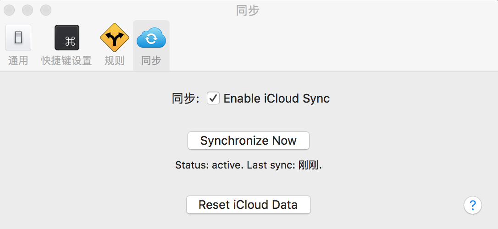

> ps:这是我本人比较喜欢的一篇文章,非常实用

当你在办公室和家里有多台mac时，数据如何保持同步
可以做到无缝切换电脑的效果

**同步的基本思想是：将常用的配置或文件保存在坚果云中，实现跨设备的同步**

- 笔记同步
- 文件同步
- 书签同步
- postman同步
- 密码同步
- hosts同步
- 代码同步
- Atom配置同步
- 粘贴板同步

<!--more-->

# 笔记同步

1. 【推荐】使用mac自带的`备忘录`记笔记，会自动通过`iCloud`同步，免费.缺点是不支持markdown和分类
2. 使用`Bear`订阅功能，通过`iCloud`同步所有的笔记，收费10元/月
3. 印象笔记，免费版只支持两台设备,目前也支持markdown了

# 文件同步

使用云盘

1. 【推荐】`坚果云`，免费版一周可以用1G流量
2. `Dropbox`（可能存在网络问题）
3. `百度云盘`，无法自动同步，免费版下载速度慢
4. `金山快盘`，已关闭

# 书签同步

☆☆☆☆☆

1. 【推荐】safari

2. chrome（须登录，可能存在网络问题）

3. 【推荐】基于chrome的homely扩展，结合坚果云的同步功能实现
效果预览：

实现方式：

* 下载homely扩展并安装

* 配置你的书签页面
* 将配置文件导出到坚果云，默认只能导出到Download目录，需要自己拷贝到坚果云文件夹中
* 同步完成后，在另一台设备中导入配置文件

导入导出的入口在:

# postman同步

postman是模拟api接口请求的工具
用相同的账号登录了postman之后，你请求的历史记录和收藏的api都可以自动同步

# 密码同步

1. 【推荐】LastPass，支持软件版和主流的浏览器的插件版

2. 1Password

3. 钥匙串

	> 2018-10-15：最新的ios12系统钥匙串功能得到了极大的提升

# Hosts同步

☆☆☆☆☆

SwitchHosts，须手动备份

使用`文件/导出`功能将hosts文件导出到坚果云

注意：只有显示了Dock图标才能看到`文件/导出`功能

另一台电脑直接从坚果云中导入，即可

# 代码同步
git或svn

# Atom同步
如果你用的是Atom编辑器,可以下载`Sync setting`插件对你的插件、设置等进行备份

只需要在设置里填写你的Personal Access Token和Gist Id就可以了
这两个都在github上申请，获取方式如下：

Personal Access Token：[https://github.com/settings/tokens](https://github.com/settings/tokens
)

Gist Id：[https://gist.github.com/](https://gist.github.com/)

# 粘贴板同步

需求不大

1.mac的通用剪切板功能可以实现

2. Paste

