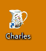
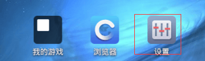
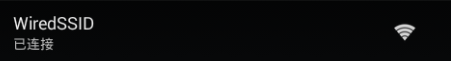
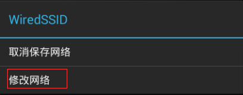
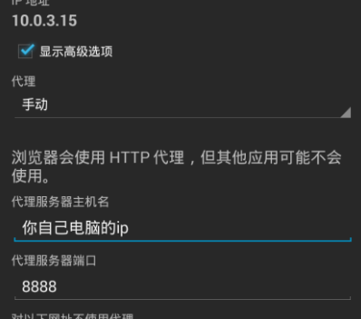
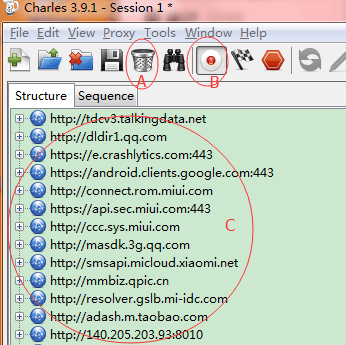
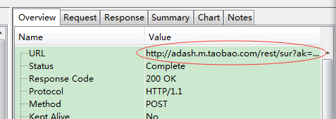
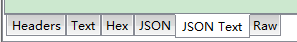

>通过charles对手机app进行抓包，应该算是客户端、服务端、测试应该掌握的基本技能了。如果你没有一台安卓手机，又想抓取安卓app的请求的话，可以考虑在电脑上安装安卓模拟器，然后通过charles或fiddler进行抓包

<!--more-->

# 准备工作

1. 安装抓包工具charles（或fiddler）

2. 安装安卓模拟器

开始装的是bluestacks，但不支持安装内核低的安卓包，卸载的时候还费了老大的劲，完全卸载可参考http://www.ptbus.com/view/41755/。

后来选择了夜神安卓模拟器，效果很赞，免费软件

# 设置
夜神模拟器安装完成后 点`设置-wlan`
>注意：这里说的设置不是安卓模拟器软件顶端的这个设置

而是在模拟的安卓系统内的设置

选择设置中的wifi

鼠标长按默认的wifi进入修改界面

点修改网络，选择“显示高级选项”，设置网络代理：主机名设置成你电脑的ip，端口填8888，保存

这样，我们就设置好代理了，然后只要启动抓包工具就可以抓包了。

注意：在设置过代理后，只有先打开下面的抓包工具，安卓模拟器才能正常联网。

# 抓包

打开charles，界面如下

A：清空所有请求

B：打开\关闭 获取请求，在不抓包的时候点B关闭获取请求，降低系统负担

C：获取的请求列表

点击选中一个请求后，在右侧可以看到请求的详细数据

overview包含请求的链接

request：请求的入参

response：请求的出参

在respons的最下方可以选择展示的出参的类型：
