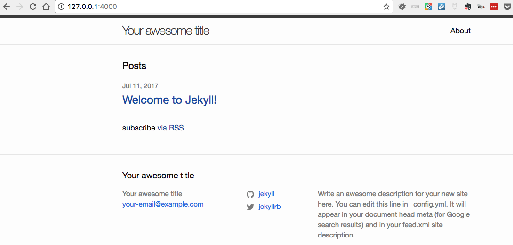

jekyll是和hexo一样的静态博客框架

```
brew install ruby    //安装ruby环境
gem install jekyll   //安装jekyll
jekyll new blog      //新建一个本地站点
cd blog
jekyll server  启动本地服务器

```


<!--more-->

启动本地服务器后，终端显示如下：

```
Configuration file: /Users/jim/jimxu-blog/_config.yml
       Deprecation: The 'gems' configuration option has been renamed to 'plugins'. Please update your config file accordingly.
            Source: /Users/jim/jimxu-blog
       Destination: /Users/jim/jimxu-blog/_site
 Incremental build: disabled. Enable with --incremental
      Generating...
                    done in 0.39 seconds.
 Auto-regeneration: enabled for '/Users/jim/jimxu-blog'
    Server address: http://127.0.0.1:4000/
  Server running... press ctrl-c to stop.
```
此时访问`http://127.0.0.1:4000/`预览生成的网站
按`ctrl+c`关闭本地服务器

初始效果：



安装时如果报`jekyll 3.5.0 | Error:  bundler`的错误:

```
gem install jekyll bundler
```

启动server时报` Operation not supported on socket @ rb_sysopen - /Users/jim/Library/Application Support/Google/Chrome/App Shim Socket`错误：

>需要先进入生成的项目目录再执行jekyll server命令
