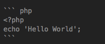

一篇关于markdown的简单介绍。

<!--more-->

## 编辑器
- ~~Mou~~
- MacDown（Mac推荐）
- Typora (Mac推荐，所见即所得，跟Macdown是两种不同风格的编辑器)
- Haroopad (Windows推荐)
- Sublime\Atom\VSC

## 标题

```
# 一级标题
## 二级标题
### 三级标题
```

效果：

# 一级标题
## 二级标题
### 三级标题

## 字体效果

```
**粗体**
*斜体*
++下划线++
==高亮==
word^上标^
word~下标~
```
效果：

*斜体*
++下划线++
==高亮==
word^上标^
word~下标~

## 代码

使用 三个`符号各两行表示代码块，如下所示

在第一行后面可以备注代码的语言，大部分网站可以根据语言不通显示不同的配色效果



效果

``` php
<?php
echo 'Hello World';
```


## 插入图片和网址

```
[一个普通的网址](http://www.baidu.com)

```


效果：

[一个普通的网址](http://www.baidu.com)


## 列表
### 有序列表

```
1. 第一件事
2. 第二件事
3. 第三件事
```

效果：

1. 第一件事
2. 第二件事
3. 第三件事

### 无序列表
```
- 无序列表
- 无序列表
- 无序列表
```
效果：
- 无序列表
- 无序列表
- 无序列表

### 任务列表
```
- [x] 今天干了啥
- [x] 今天干了啥
- [ ] 今天有啥没干
```

效果：
- [x] 今天干了啥
- [x] 今天干了啥
- [ ] 今天有啥没干


## 目录
不一定支持

```
[TOC]
```

[TOC]


如果你要用markdown写博客，推荐看[此文](https://16bh.github.io/2018/10/15/a-cool-way-to-blog-by-hexo-and-typora/)

