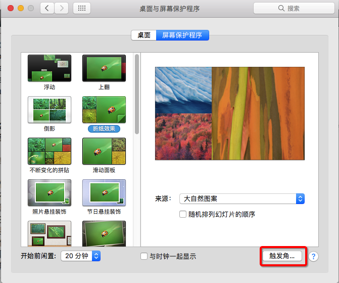
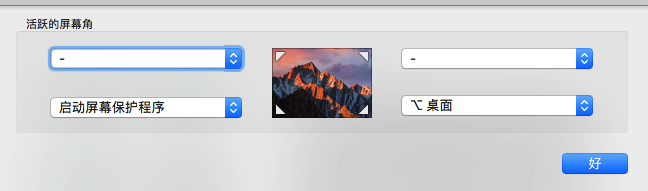
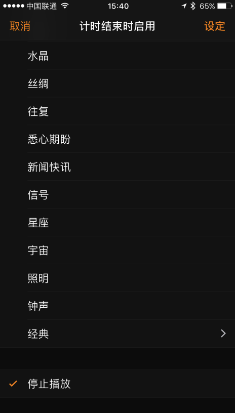

随便提几个苹果电脑和手机的一些快捷键和小技巧

<!--more-->
# 快捷键
- 快速打开文件 `comm + o`
- 在finder中显示隐藏文件 `comm + shift + .`
- 重命名文件 `enter`
- 打开任务管理器 `comm + option + esc`
- 显示文件简介 `comm+i`
- 隐藏除当前窗口之外的其他窗口 `comm+option+h`
- 打出苹果logo   `option+shift+k`

# 小技巧
- 修改文件默认打开方式：显示文件简介后，选择打开方式，选择全部更改

- 触发角
路径：`系统偏好设置 - 桌面与屏幕保护设置 - 触发角`

可以设置光标移动到四个角落时触发的动作，如下图的设置，当光标移动到左下角的时候自动触发屏幕保护并锁定电脑

为了防止误操作，可以在设置的时候可以按住command、option、shift、ctrl辅助键，设置联合热键，如图只有当按住option键并将光标移动到右下角才会触发回到桌面

- safari浏览器标签右侧的+ 长按可以显示最近打开的一批页面
- 按F1 F2GoSublime调节亮度或者F11 F12调节音量的时候，同时按shift+option键，可以一次只调节原来1/4
- 按住command键可以拖动菜单栏图标的问题
- 按住option键点击菜单栏上的通知中心图标可以关闭通知，重复操作开启通知
- 设置纯黑壁纸后， macOS 自带了一个暗色主题，打开「系统偏好设置 / 通用」勾选「使用暗色菜单栏与 Dock]
- 从官网下载的网易云播放器可以通过F7 F8 F9控制音乐播放

# iphone技巧
- 手机插上自带的耳机并打开相机时，可是将耳机的音量键当快门使用
- 时钟 - 计时器可以设置到时间关闭音乐播放

2018-10-15补充：

mac中需要插入图片时，可以通过iphone拍照插入

mac和iphone可以公用剪贴板

mac中需要输入手机验证码时，可以通过imessage自动填写