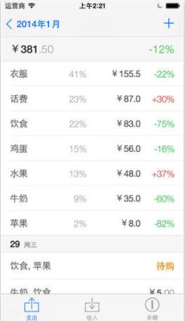

列举个人使用的ios软件。

<!--more-->
## 必备
- Gboard  Google应用自带输入法

# 工作
- `网易邮箱大师` 
- `Mail`  系统自带的邮件客户端

# 生活

- `财禅`  记账软件，非常好用，支持为每笔支出建立tag，按tag或者日期统计
  
- `随手记` 在线记账软件
- 即刻`  消息推送，选择感兴趣的话题即可获得推送
  
- `微博国际版`  无广告版微博
- `花生地铁WiFi` 
- `哔哩哔哩` 这还用说
- `豆瓣` 查询电影、书籍，改版后好用了很多
- `Inoreader`  免费RSS阅读
- `Reeder` RSS阅读，支持包括inoreader在内的多项服务
- `Google相册` 自动备份相册，智能！！！

## 学习
- 五十音图 

# 效率
- `Todolist`  代办任务列表
- `微习惯`  给自己建一些每日要完成的任务，每完成一项可以打卡，有助于培养良好的习惯
- `Today`  习惯养成工具，单个任务可以多次签到，适用于上下班打卡等场景
- `Day One`  日记，支持Mac同步，iphone买断，mac订阅
- `奇妙清单` 清单工具，支持Mac同步
- `Workflow` 工具流工具，2017年3月23日被苹果收购后免费，后更名`捷径`
- `LastPass`
- `Pin`
- `锤子便签` 自带截长图工具
- `bear` 笔记
- `Evernote`

# 游戏
- `三国杀OL` 
- `皇室战争` 
- `炉石传说` 
- `王者荣耀` 
- `阴阳师` 
- `龙之谷` 

# 工具
- `Clocks`
- `Calcbot`
- `小米计算器` 可以计算亲戚称呼
- `雨时`
- `小历`
- `微软识花`
- `照片扫描仪` 微软出品，将纸质照片识别成电子相片
- `Wingy` 梯子工具
- `Picsew` 长图工具
