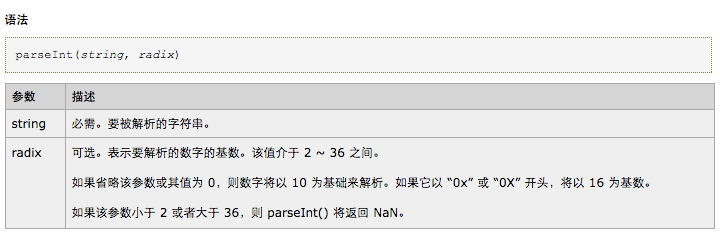

学习廖雪峰老师的`javaScript`教程笔记。

重点关注`js`与`PHP`的异同点

<!--more-->

# 入门
## 变量
用`var`申明变量，后面跟变量名称，在方法体内不使用`var`申明的是全局变量，在方法体外申明的变量也是全局变量
``` js
var a = 1;
```
在`php`中申明变量在变量名前面加上`$`符号
``` php
$a = 1;
```


`js`中可以先申明变量再赋值，`php`中没有创建变量的命令，变量会在首次给它赋值的时候被创建

##  strict模式
开启`strict`模式后，若不使用`var`申明变量，浏览器会报错
``` js
'use strict';
```

## 查看变量类型
``` js
var a = 1;
console.log(typeof a);
```
> 输出结果：
> number

``` php
$a =1;
echo getType($a);
```
> 输出结果：
> integer

变量类型对比如下：

类型|js|php
---|---|---
整数|number|integer
小数|number|double
字符串|string|string
布尔值|boolean|boolean
数组|object|array


## ==与===
`==`会自动转换数据类型再比较，所以比较的时候用`===`
与`PHP`中功能类似

## 浮点数
要比较两个浮点数是否相等，只能计算它们之间的差值的绝对值是否小于某个阈值

``` javaScript
Math.abs(1 / 3 - (1 - 2 / 3)) < 0.0000001;
```

> php中同理

## 数组

可以用`array()`和`[]`两种表示方法，跟php相同

> 用`[]`表示数组是`php``5.4`版本之后才有的功能

## 对象
用`{}`表示对象
在`php`中不区分对象和数组，对象被视为一维数组，也用`array()`及`[]`表示

## 输出
- `js`中用`alert()`方法在浏览器中弹窗显示文本，`console.log()`方法打印输出

- `php`中用`echo()`或`print()`方法输出字符串，不同之处在于`print()`输出后会返回1，而`echo()`输出后返回void；用`print_r()`和`var_dump()`方法输出数组,二者的区别在于`var_dump()`会显示变量的类型，`prinr_r`无法区分`0`与`0.0`或`false`与`''`,如下所示：

``` php
$values = array(0, 0.0, false, '');
var_dump($values);
print_r ($values);
```
> 结果为：
> array(4) {
>   [0]=>
>   int(0)
>   [1]=>
>   float(0)
>   [2]=>
>   bool(false)
>   [3]=>
>   string(0) ""
> }

> Array
> (
> ​    [0] => 0
> ​    [1] => 0
> ​    [2] =>
> ​    [3] =>
> )

# 字符串
## 单引号和双引号
`js`和`php`都可以用`''`和`""`表示字符串，都可以在`""`中直接使用`''`,区别在于在`php`中，单引号字符串中的反斜杠只能转义单引号`'`和反斜杠`\`

如下所示:
``` js 1.js
console.log('I\'m \"aaa\"!');	//输出I'm "aaa"!，跟php不同
console.log('bbbb');	//输出bbbb，同php
console.log("'cccc'");	//输出'cccc'，同php
console.log("\'dddd\"");	//输出'dddd"，同php
```

``` php 1.php
<?php
echo 'I\'m \"aaa\"!';	//输出I'm \"aaa\"!,说明单引号中无法转义双引号字符
echo 'bbbb';	//输出bbbb
echo "'cccc'";		//输出'cccc'
echo "\'dddd\"";	//输出'dddd"
```

## 字符串函数
功能|php|js
---|---|---
字符串长度|length属性|strlen()
转大写字母|toUpperCase()|strtoupper()
转小写字母|toLowerCase()|strtolower()
在字符串内搜索|indexOf()|strpos()
截取字符串|substring()|substr()
字符串连接|+符号|.符号

>substring(2,4)是从第2位截取到第4位（不包括第4位）
>substr(2,4)是从第2为开始截取，总共截取4位

示例：
``` js 2.js
var a = "abCDefg";
console.log(a.length);		//输出7
console.log(a.toUpperCase());	//输出ABCDEF
console.log(a.toLowerCase());	//输出abcdef
console.log(a.indexOf('e')); 	//输出4
console.log(a.substring(2,4));	//输出CD,注意与php的不同之处
console.log('a'+'b');	//输出ab
```
``` php 2.php
<?php
$a = "abCDefg";
echo strlen($a);	//输出7
echo strtoupper($a);	//输出ABCDEF
echo strtolower($a);	//输出abcdef
echo strpos($a,'e');	//输出4
echo substr($a,2,4);	//输出CDef
echo 'a'.'b';	//输出ab
```

# 数组
## 数组函数：

功能|js|php
---|---|---
数组长度|length属性|count()
在数组中查找|indexOf()|array_search()
数组截取|slice()|array_slice()
数组尾部插入元素|push()|array_push(),一般不用
数组尾部删除元素|pop()|array_pop()
数组头部插入元素|unshift()|array_unshift()
数组头部删除元素|shift()|array_shift()
数组排序|sort()|sort()
删除并替换数组中指定的元素|splice()|array_splice()
数组合并|concat()|array_merge()
将数组中的元素用字符连接成字符串|join()|implode()

> `js`中的`slice(2,4)`截取第2位到第4位（不包括第4位）的元素;`php`中的`array_slice(2,4)`截取第2位到第4位（包括第4位）的元素

示例：
``` js 3.js
var arr = ['b','c','e','a','d'];
console.log(arr.length);	//输出5
console.log(arr.indexOf('e'));	//输出2
var arr2 = arr.slice(2,4);console.log(arr2);	//输出[ 'e', 'a' ]，注意与php的不同之处
arr.push('F');console.log(arr);	//输出[ 'b', 'c', 'e', 'a', 'd', 'F' ]
arr.pop();console.log(arr);	//输出[ 'b', 'c', 'e', 'a', 'd' ]
arr.unshift('A');console.log(arr);	//输出[ 'A', 'b', 'c', 'e', 'a', 'd' ]
arr.shift();console.log(arr);	//输出[ 'b', 'c', 'e', 'a', 'd' ]
arr.sort();console.log(arr);	//输出[ 'a', 'b', 'c', 'd', 'e' ]
arr.reverse();console.log(arr);	//输出[ 'e', 'd', 'c', 'b', 'a' ]
arr.splice(2,3,'f');console.log(arr);	//输出[ 'e', 'd', 'f' ]
console.log(arr.concat(['g','h']));	//输出[ 'e', 'd', 'f' ]
console.log(arr.join('-'));	//输出e-d-f
```

``` php 3.php
$arr = ['b','c','e','a','d'];
echo count($arr);	//输出5
echo array_search('e', $arr);	//输出2
$arr2 = array_slice($arr,2,4);print_r($arr2);	//输出[ 'e', 'a','d']，注意与php的不同之处
array_push($arr,'F');print_r($arr);	//输出[ 'b', 'c', 'e', 'a', 'd', 'F' ]
array_pop($arr);print_r($arr);	//输出[ 'b', 'c', 'e', 'a', 'd' ]
array_unshift($arr,'A');print_r($arr);
	//输出[ 'A', 'b', 'c', 'e', 'a', 'd' ]
array_shift($arr);print_r($arr);	//输出[ 'b', 'c', 'e', 'a', 'd' ]
sort($arr);print_r($arr);	//输出[ 'a', 'b', 'c', 'd', 'e' ]
rsort($arr);print_r($arr);	//输出[ 'e', 'd', 'c', 'b', 'a' ]
array_splice($arr,2,3,'f');print_r($arr);	//输出[ 'e', 'd', 'f' ]
$arr2 = array_merge($arr,['g','h']);print_r($arr2);	//输出[ 'e', 'd', 'f' ]
print_r(implode('-',$arr));	//输出e-d-f
```

# 对象
## 在js和php中的区别
- `js`中的属性，相当于`php`中数组的键

- `js`中的对象是`key-value`的形式，而数组不是,对象中的属性可以直接用`对象名.属性名`进行访问

- `js`中若属性名中包含特殊字符，需要用`''`括起来,`php`中键若不为数字，也要用`''`括起来

## 对象方法

功能|js|php
---|---|---
获取对象中属性|.|下标
删除属性|delete|unset()
判断属性是否存在|in|in_array()
判断属性是否存在且是自身的属性|hasOwnProperty()|in_array

> `js`所有的对象都继承自`object`对象，所以也拥有`object`对象的属性，如`toString`,若要判断一个对象自身的属性是否存在时，用`hasOwnProperty()`方法

示例：
``` js 4.js
var obj = {
    a2:1,
    'a-2':2,
    test:3,
};
console.log(obj.a2);	//输出2
delete obj.test;console.log(obj);	//输出{ a2: 1, 'a-2': 2 }
console.log('name' in obj);	//输出false
console.log('toString' in obj);	//输出true
console.log(obj.hasOwnProperty('toString'));	//输出false
```

``` php 4.php
<?php
$obj = array(
        'a2' => 1,
        'a-2' => 2,
        'test' => 3,
    );
echo $obj['a2'];	//输出2
unset($obj['test']);var_dump($obj);	//输出{ 'a2' => 1, 'a-2'=> 2 }
var_dump(in_array('name',$obj));	//输出false
var_dump(in_array('toString',$obj));	//输出false
```

# 条件与循环
## 条件语句
`if-else`条件语句的使用方法完全一致

>`js`把`null`、`undefined`、`0`、`NaN`和空字符串`''`视为false，其他值包括`[ ]`、`{}`一概视为true
>`php`把`null`、`0`、`''`、`[ ]`视为false,`NaN`与`undefined`在`php`没有特定意义，会视为true

## 循环语句
`for`、`while`、`do...whild`、`break`用法二者完全一致

更便捷的遍历数组的方法，`js`中有`for in`，`php`中有`foreach`
示例：

``` js 5.js
var arr = ['a','b','c'];
for(var i in arr){
    console.log(i+'-'+arr[i]);
}
```
> 运行结果：
> 0-a
> 1-b
> 2-c

``` php 5.php
<?php
$arr = ['a','b','c'];
foreach($arr as $key => $value){
    echo $key.'-'.$value."\n";
}
```
> 运行结果：
> 0-a
> 1-b
> 2-c

# Map、Set、iterable(ES6)

---
从下面开始基本上已经找不到跟`php`类似的地方了
---

# 函数
## 函数的定义
`js`中没有`return`语句会返回`undefined`,`php`则不会

``` js
function abs(x){
	... ...
}
```
等价于

``` js
var abs = function (x) {	//定义匿名函数，没有函数名，通过变量名abs调用函数
    ... ...
    };	//以分号收尾
```
第二种定义函数的方式只有`js`支持，`php`不支持

## 函数入参
>arguments指向当前函数的调用者传入的所有参数
``` js
function add(){
    var sum=0;
    for(var i=0;i<arguments.length;i++){
        sum +=arguments[i];
    }
    return sum;
}
console.log(add(1,2,3));	//输出6
```

>rest(ES6)指向当前函数的调用者传入的除已定义参数外的其它参数
``` js
function foo(a, b, ...rest) {
    console.log('a = ' + a);
    console.log('b = ' + b);
    console.log(rest);
}
foo(1, 2, 3, 4, 5);
// 结果:
// a = 1
// b = 2
// Array [ 3, 4, 5 ]
foo(1);
// 结果:
// a = 1
// b = undefined
// Array []
```

## 变量提升
JavaScript的函数定义有个特点，它会先扫描整个函数体的语句，把所有申明的变量“提升”到函数顶部

>意思是说如果你先使用变量，再在后面申明不会报错，但是前面使用的变量值是`undefined`,所以要用的变量最好提前声明

``` js
function foo() {
    var x = 'Hello, ' + y;
    alert(x);
    var y = 'Bob';
}
foo();
```
>输出：
>Hello, undefined

## 全局作用域

默认的全局对象`window`，全局作用域的变量和方法都被绑定为`window`的一个属性

``` js
'use strict';
var a = 3;
console.log(a);
console.log(window.a);
function func(){
    console.log('test');
}
func();
window.func();
```

>输出：
>3
>3
>test
>test

## 块级作用域let
比`var`的作用范围小，可以只在`if`、`for`的代码块中生效

变量的作用域：
`全局变量 > 成员变量 > 块级变量`

s
## ES6可以用`const`声明常量
用`var`来申明常量，属于一种约定,意思是告诉别人我申明的是一个常量，但修改它的值不会报错

如果常量是用`const`申明的话，修改它的值会报错

## this
函数内部`this`指向
如果以对象的方法形式调用，如`object.func()`,那么`func()`方法中的`this`就指向`object`对象；单独调用`func()`方法中的`this`指向全局的`window`对象(`strict`模式下指向`undefined`)

## 高阶函数
`js`中函数也可以当做变量
以函数为入参的函数就是高阶函数

### map
>用指定的方法作用于数组中的每一个元素

``` js
var arr = [1,2,3,4];
var add = function(x){
    return ++x;
};
var arr2 = arr.map(add);	//相当于[1+1,2+1,3+1,4+1]
alert(arr2);
```
>结果为：
>2,3,4,5

如果`map`参数中使用的方法支持多个入参，需要小心，可能踩坑。看下面的例子（`parseInt`是字符串转换为整数的方法）：
``` js
var arr = ['1','2','3','4'];
var arr2 = arr.map(parseInt);
alert(arr2);
```
>输出
>[ 1, NaN, NaN, NaN ]

为了帮助理解，我们看一下map方法向它向作为参数的函数传递的是怎样的参数
``` js
var arr = ['1','2','3','4'];
var arr2 = arr.map(function(){
	alert(arguments);
});
```
>输出：
>{ '0': '1', '1': 0, '2': [ '1', '2', '3', '4' ] }
{ '0': '2', '1': 1, '2': [ '1', '2', '3', '4' ] }
{ '0': '3', '1': 2, '2': [ '1', '2', '3', '4' ] }
{ '0': '4', '1': 3, '2': [ '1', '2', '3', '4' ] }

`map`传递了三个参数：`值`、`索引`、`数组`

而`parseInt`函数说明如下：


之前的程序相当于依次执行下面的操作：
``` js
parseInt(1,0);
parseInt(2,1);
parseInt(3,2);
parseInt(4,3);
```

### reduce
>指定的方法作用于数组的前两个元素，得到的结果与下一个元素重复此过程

``` js
var arr = [1,2,3,4];
var add = function(x,y){
	return x+y;
};
var arr2 = arr.reduce(add);	//相当于((1+2)+3)+4
alert(arr2);
```
>结果为：
>10

### filter
>在`filter`的入参中指定筛选的规则,最后返回数组中满足条件的部分

``` js
var arr = [1,2,3,4];
var rule = function(x){
    return x % 2 == 0;
};
var arr2 = arr.filter(rule);
alert(arr2);
```
>输出:
>2,4

### sort
>默认的`sort()`方法先将要比较的对象先转为字符串再比较，比较字符串的时候会根据`ASCII`值进行比较

因此如果直接用`sort`方法比较整数数组数组时，可能会出现问题，如下

``` js
alert([1,2,10].sort());
```

>输出结果：
>1,10,2

好在`sort`方法是个高阶函数，允许我们在使用的时候指定排序的规则：

``` js
alert([1,2,10].sort(function(x,y){
    if(x>y){return 1;}
    if(x=y){return 0;}
    if(x<y){return -1;}
}));
```

>输出结果：
>1,2,10

# 闭包
# 箭头函数
# gennerator


