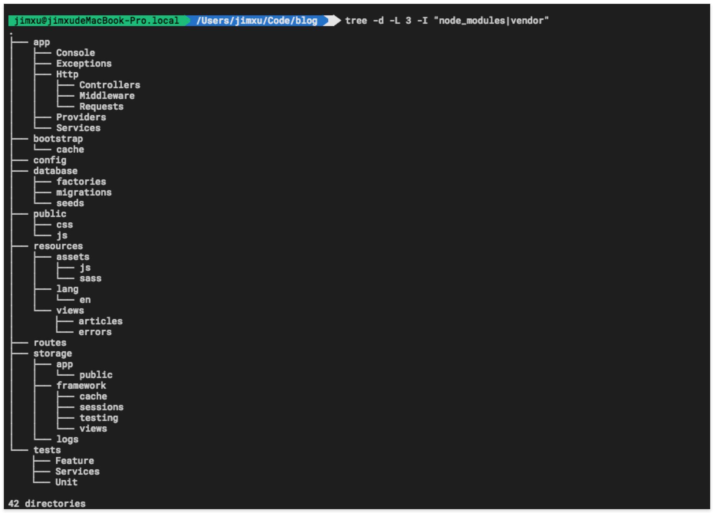

laravel目录

<!--more-->

* routes 路由
* app	 模型
* resources/views  blade视图
* app/Http/Controllers 控制器
* config 配置文件
* database  数据库
* database/factory 数据库工厂，和seeds一道生成测试数据
* database/migrations  数据库迁移
* public/css css资源
* public/js js资源
* resources/lang/en  语言包
* tests  单元测试
