列举一些个人使用的mac软件
---
更新时间：2017年3月13日14:41
更新内容：增加部分软件，并给软件打分


<!--more-->
# 装机必备

- `LastPass`  从此只要记住一个密码
- `Xee3` 	比系统自带图片浏览效果更佳,可以直接查看下一张图片
- `The Unarchiver` 	免费解压
- [`Appcleaner`](https://freemacsoft.net/appcleaner/)  免费软件卸载
- `PDF Expert`    PDF阅读工具，收费
- `Folx`   下载工具
- `Evernote`   云笔记，配合浏览器的剪裁插件，一键保存网页内容到笔记本中，有移动版本
- ~~`Quiver`  必装，程序员必备知识库整理工具 支持markdown语法，暂时没有移动端(破解版bug比较多)~~
- `iTools`  管理iphone工具
- `Mail`  自带的邮件客户端
- `ShadowsocksX`  必装,科学上网工具
- `f.lux`  自动调节屏幕亮度
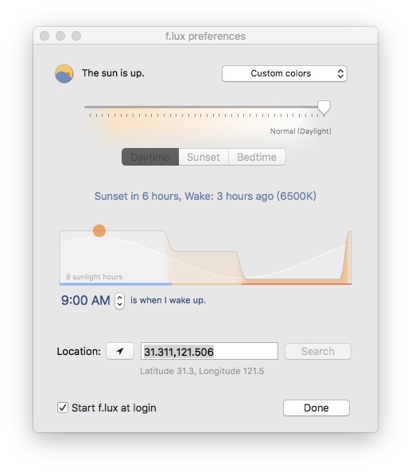
- `XCode`  基础工具


# 开发工具

- `SourceTree`   必装，git客户端

- `github desktop` git客户端

- `Cornerstone`  svn客户端

- `Sequel Pro`   免费数据库管理工具

- `Navicat Premium`  prosql数据库管理工具

- `Chrome`   开发最佳浏览器（之一）
  必装插件

    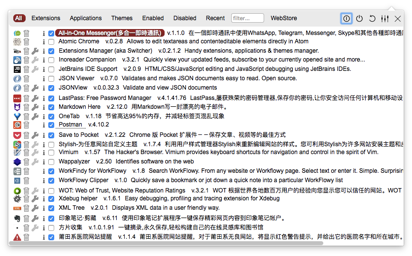


- `Charles` 必备，抓包工具
- `Dash`  收费开发参考手册，并且能与各种浏览器整合
- [`devdocs`]( http://devdocs.io )  [helloSwift](https://www.v2ex.com/member/helloSwift)推荐的Dash替代产品，免费
  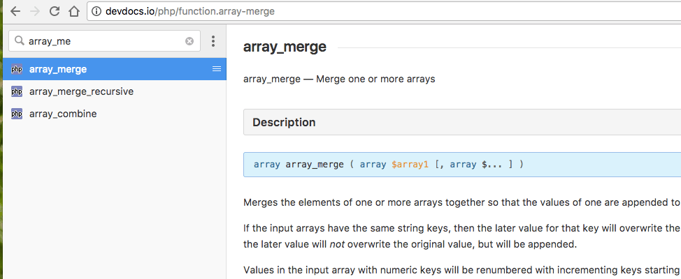
- ~~`Gas Mask`  管理hosts文件,最新版本系统不支持~~
- `iHosts`  hosts管理工具
- `switchHosts`  hosts管理工具，可以分组，我在用的
- `iThoughtsX`   思维导图，收费
- `MindNode`  思维导图工具，收费
- [`Process On`](https://www.processon.com/i/5760ecd1e4b04678e07895bb)  在线制作流程图工具,免费，有次数限制，邀请好友可以增加次数
- `OmniGraffle` 流程图制作，贼好用
- `postman`  模拟post请求
- `Cocoa Rest Client`
- `DiffMerge`  免费的代码比对工具,基本够用
- [`Beyond Compare`](http://www.scootersoftware.com/download.php)  代码比对
- `Medis`  收费的redis交互软件
- `redis desk manager`  免费的可视化redis工具，缺点是在mac系统容易crash，可能跟我用的是破解有关系

# 服务
- php   系统自带了5.3版本的php，可以删除掉安装自己想要的版本，也可以安装多个版本
- nginx/apache 系统自带了apache，启用即可，未默认安装nginx，需要手动安装
- mysql
- homebrew/homebrew-cask 必备，用homebrew来安装常用的服务如php等，用homebrew-cask安装软件，运行一句命令行即可安装

# 效率
- `Quitter` 	自动隐藏或关闭闲置的窗口

- `spotlight`           系统自带，启动软件，查找文件

- `Alfred` 	Spotlight替代，快速启动软件，workflow功能。（注：免费版够用了，没有workflow功能也能接受）


  重点推荐以下workflow，可以自己google到扩展包
  一是`,b`,可以直接在`Alfred`搜索chrome浏览器的书签
  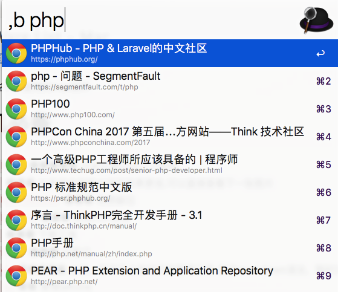
  二是`markdown image`可以将剪贴板中的截图文件上传到七牛云，并转换为markdown可用的图片链接
> 此插件可以用U图床代替

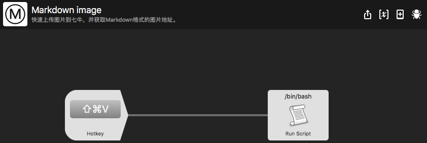
三是Dash插件 直接dash+你要搜索的关键字
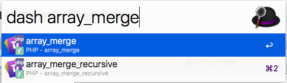

- `Yoink` 	收费，临时存放文件
- `Paste` 	收费，记录剪切历史，随时调用之前剪切的内容，甚至可以搜索你之前剪切的内容
- `PopClip`   收费，选择文字会自动弹出菜单，提供复制、粘贴、保存到印象笔记等各种扩展功能
- `Moom`   收费，调节窗口大小，并实现Windows经典功能，拖动窗口到屏幕的最左边或最右边的时候会自动半屏，拖动到屏幕左上边会自动全屏
- `Magnet`  功能跟Moom一样，免费哦
- `Manico`   快速启动dock栏软件，其实用Alfred就够了
- `HyperDock`   预览软件打开的窗口，拖动窗口自动半屏、全屏
- `uBar` windows任务栏效果,不过挺贵
  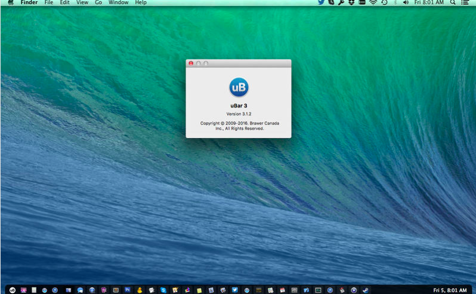
- `Bartende`  收费，整理菜单栏，将不常用的菜单栏图标隐藏起来
- [`Vanilla`](http://vanilla.matthewpalmer.net/r/6d400915)  类似Bartender,免费的菜单栏工具，收费升级pro
- `aText`   收费，片段工具，输入简短的别名替换成复杂的终端命令、代码片段等
- `textExpander` 收费，没用过功能同`aText`,更贵
- `奇妙清单`(`WunderList`)		 免费，清单工具，移动端同步
- `todoList`  任务管理，和移动端同步
- [`todolist`](http://todolist.site/#quickstart) 在终端显示任务列表
  安装方式：

```shell
homebrew install todolist
```

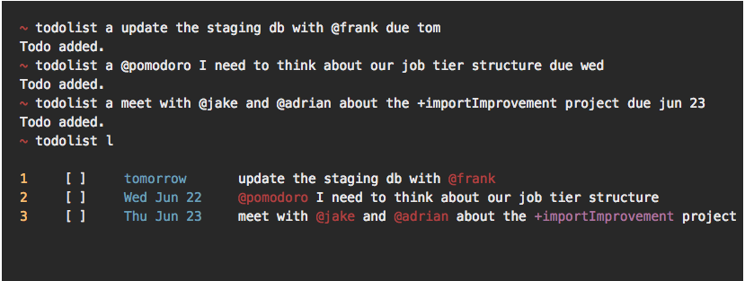

- `RescueTime`  【拯救你的时间】，顾名思义，可以记录你的软件使用习惯，看你一天工作和娱乐的时间占比是多少，程序员的话更推荐下面的插件
- `wakatime`  免费，收费服务更强大，超强插件，程序员编程习惯统计，可以统计你在不同的编辑器或者语言上分配的时间，支持几乎所有主流的编辑器
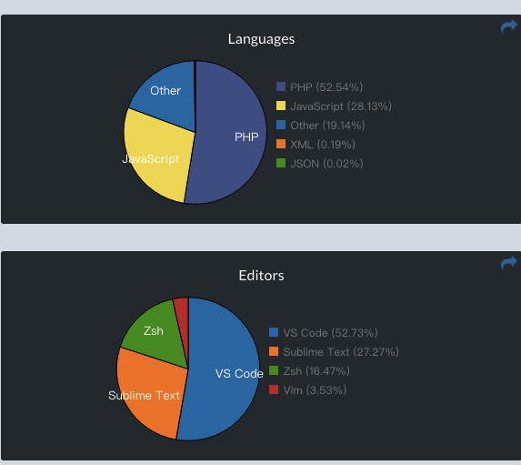
- `PixelScheduler`  在屏幕右侧以线条的形式显示一天的日程，限免


- `Go2Shell`  在Finder中打开终端并进入当前项目路径,支持默认终端，不支持iterm2,按住Command的键将app拖到finder菜单栏
- `TermHere`  在Finder中打开终端并进入当前项目路径，支持iterm2
- `Pocket`   延迟阅读，搭配浏览器插件使用，将别人分享或自己看到的好文章保存备用


# 工具
- `Fluid` 	将常用的网页转化成简易app的工具，如石墨、tower、网页版微信、v2ex、豆瓣音乐等
- `CheatSheet`   长按Command键显示当前可用的快捷键
- `Snip`    腾讯出品的截图小工具，简单实用，可以加注释,唯一的缺点是电脑外接显示器后无法使用
- `Jietu`  腾讯出品的另一款截图工具，支持录屏

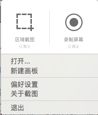


- `Teampaper Snip`  在用的截图工具，完美支持多显示器🖥
- `SnapNDrag Pro`  功能强大的截图工具，会将所有的截图保存在自己生成的文件夹中并分类，不可注释，外接显示器后也能使用
- `Noizio`   生成白噪音
- `Boom2`   音效增强，效果一般
- `Gemini 2`  清除重复文件
- `Backgrouds`+[火萤](http://huoying666.com/)   动态桌面，可能导致卡顿和耗电量增加
- `爱壁纸HD`		更换壁纸
- `Caffeine`   超实用，暂时关闭电脑自动休眠，当你看电影或放映ppt的时候，不会屏幕突然黑掉，再次点击可以关闭此功能。打开的时候图标上的咖啡杯是满的，关闭后是空的，细节满分
- `Keyboard Cleaner`  键盘清洁工具，打开此软件时按键不会生效，脸滚键盘也没关系，Command+Q退出
- `Cal Cat`  在桌面显示日历，并每日更新一张猫咪的图片
- `Tickeys`  免费，模拟机械键盘音效
- `Reeder`  收费，RSS阅读，阅读体验极佳
  
- `Leaf`  RSS阅读，限免
- `scrollreveal`  修改mac触摸板滚动方向，享受触控板自然滚动的方便又不改变鼠标的使用习惯
- `Memo`  在桌面显示彩色便签

# 音乐

- `iTunes`+`Lyricsx`   苹果自带音乐播放器，可按专辑分类，加上开源的歌词工具


- `XLD` 将flac格式转换成`Apple Lossless`格式，以便导入iTunes

- `Listen1`聚合音乐，聚合了多个平台：网易·虾米·QQ·酷狗·酷我

  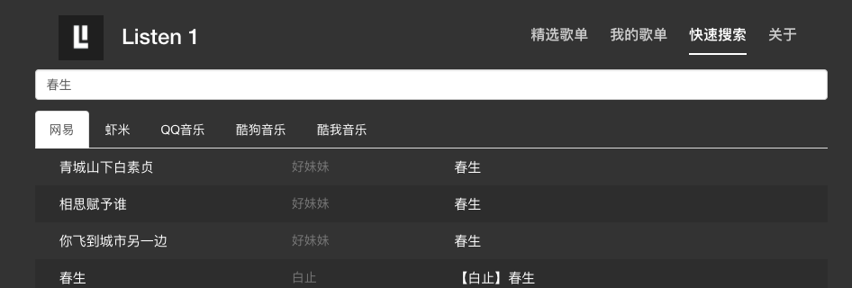

# 编辑器
- `PHPStorm` 	功能最齐全的PHP开发IDE

- `IntelliJ IDEA`  装了php插件相当于phpstorm，装了go插件相当于goland，适用于多语言多项目开发。

- `vscode`   微软出品的编辑器，潜力无穷

- `MacVim`   编辑单个文件最强大的编辑器，缺点是需要进行超多的配置

- `sublime`  最好用的轻量级编辑器,大量插件，写md文件体验也不错
    ~~U图床，支持上传图片(gif,png)到七牛云并将md格式的链接保存在剪切板中的小工具,灰常的好用~~
  

  2018-10-15：七牛测试域名过期，此软件可以下岗了

# 读书

- `kindle`  手机端pc端均可下载kindle客户端，正版图书可以自动同步阅读进度

- `Klib`  将kindle或iBooks中的标注整理到一个软件中阅读

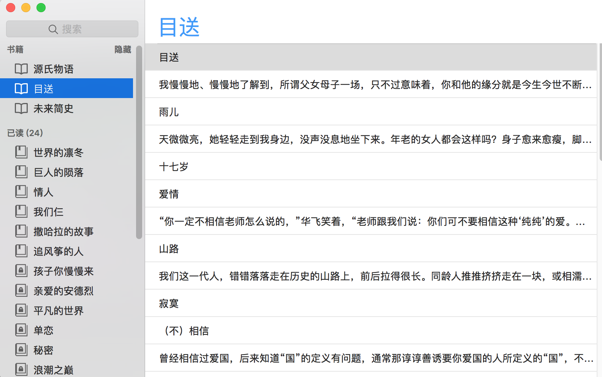

- `calibre`  迄今为止，见过的最强大的本地图书管理工具


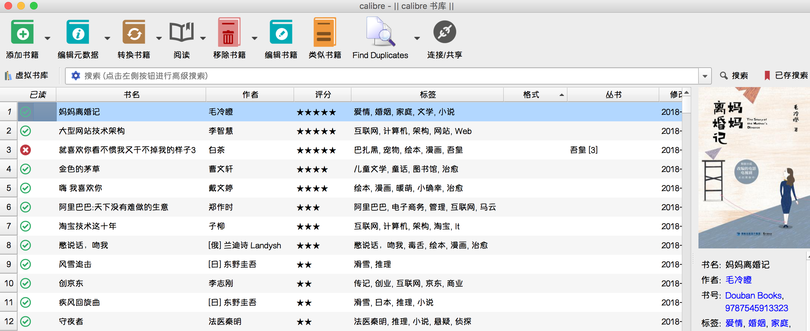

## 	其它
- 科学上网  [Agentneo](https://agentneo.rocks/?rc=nl8sqg64)
