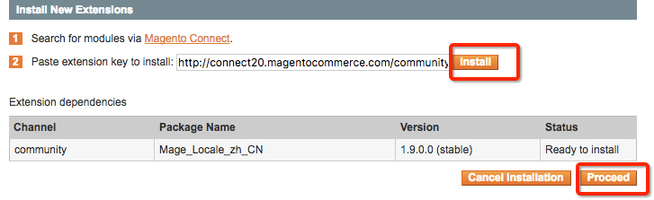
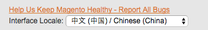
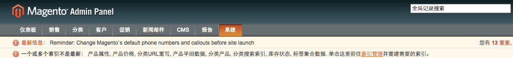

通过安装中文语言包扩展的方法进行后台汉化

<!--more-->

`System`>`Magento Connect`>`Magento Connect Manager`进入扩展安装界面

填写中文语言包key：`http://connect20.magentocommerce.com/community/Mage_Locale_zh_CN`,依次点击`install`>`Proceed`

安装完成后，返回`magento`后台，左下角`Interface Locale`选择`中文（中国）`

最终效果：

