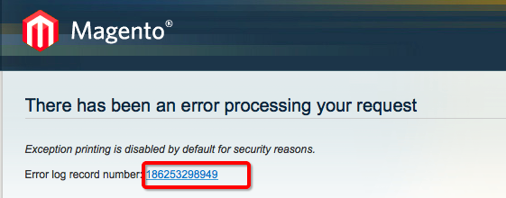

# 一 关于错误日志
使用magento的过程中经常出现图示的错误页面

红框中的部分是错误日志的编号，以下是查看对应的错误日志的方法：

1. 在***`项目根目录/var/report/错误日志编号`***文件中即可查看对应的错误信息
2. 在页面上直接显示错误信息的方法：将`项目根目录/errors/local.xml.sample`修改为`local.xml`即可(最好保留原文件)
附：通过终端命令行复制文件
```shell
cd 你的项目根目录路径/errors
cp local.xml.sample local.xml
```

<!--more-->

# 二 关于日志
1. 为什么要记日志
（1）使用`var_dump()`,`print()`等方法无法输出想要输出的内容时；
（2）监控线上接口的使用情况；
（3）调试线上错误；
（4）其它情况；
2. 怎么记日志
在magento代码中通过如下方法记录日志

``` php
Mage::log($tmp);      //$tmp是你想要记录的内容，string类型
```

记录的日志可以在***`项目根目录/var/log/system.log`***中查看

3. 在日志中记录数组

``` php
Mage::log(print_r($array,true));  //print_r()的第二个参数为true时，则不打印$array，而是将$array作为函数的返回值
```

6.29日更正：
在日志中记录数组，直接记录就可以了

``` php
Mage::log($array);
```

4. `system.log`是系统日志，如果想要将自己的日志与系统的日志区分开，那么可以这样记日志

``` php
Mage::log($log_content,null,'jim.log');
```
jim.log 即是自定义的log文件名称，可以自定义
日志记录的位置在`项目根目录/var/log/jim.log`