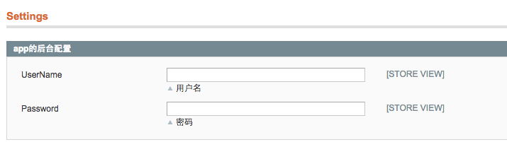

> 在后台配置一些常量，比硬编码的方式更加灵活，不需要重新改写代码并上线才能生效，直接修改后台的配置就可以了

# 后台配置文件


在模块的`etc`文件夹下新建`system.xml`和`adminhtml.xml`


<!--more-->
编辑如下：

``` xml magento-practise.local/app/code/local/Nano/App/etc/system.xml
<?xml version="1.0"?>
<config>
    <tabs>
        <appconfig translate="label" module="nano_app">    <!--nano_app是模块名-->
            <label>App Options</label>
            <sort_order>9999999</sort_order>
        </appconfig>
    </tabs>
    <sections>
        <app_options translate="label" module="nano_app">    <!--app_options是配置的唯一标识-->
            <label>Settings</label>
            <tab>appconfig</tab>
            <frontend_type>text</frontend_type>
            <sort_order>1000</sort_order>    <!--sort_order是配置的顺序-->
            <show_in_default>1</show_in_default>
            <show_in_website>1</show_in_website>
            <show_in_store>1</show_in_store>
            <groups>
                <app_setting translate="label">
                    <label>app的后台配置</label>
                    <frontend_type>text</frontend_type>
                    <sort_order>1</sort_order>
                    <show_in_default>1</show_in_default>
                    <show_in_website>1</show_in_website>
                    <show_in_store>1</show_in_store>
                    <fields>
                        <user_name>    <!--配置的用户名的唯一标识-->
                            <label>UserName</label>
                            <frontend_type>text</frontend_type>
                            <comment>用户名</comment>
                            <sort_order>1</sort_order>
                            <show_in_default>1</show_in_default>
                            <show_in_website>1</show_in_website>
                            <show_in_store>1</show_in_store>
                        </user_name>
                        <pass_word>   <!--配置的密码的唯一标识-->
                            <label>Password</label>
                            <frontend_type>text</frontend_type>
                            <comment>密码</comment>
                            <sort_order>2</sort_order>
                            <show_in_default>1</show_in_default>
                            <show_in_website>1</show_in_website>
                            <show_in_store>1</show_in_store>
                        </pass_word>
                    </fields>
                </app_setting>
            </groups>
        </app_options>
    </sections>
</config>
```

``` xml magento-practise.local/app/code/local/Nano/App/etc/adminhtml.xml
<?xml version="1.0"?>
<config>
    <acl>
        <resources>
                <admin>
                    <children>
                            <system>
                                <children>
                                    <config>
                                        <children>
                                            <app_options>
                                                <title>App Options</title>
                                            </app_options>
                                        </children>
                                    </config>
                                </children>
                            </system>
                    </children>
                </admin>
         </resources>
    </acl>
</config>
```

# Helper类

这时候若访问`magento`的后台，会报下面的错误:

说明我们需要建立`App`这个模块的`helper`类

先修改`config.xml`配置

``` xml magento-practise.local/app/code/local/Nano/App/etc/config.xml
<global>
    <helpers>
        <nano_app>
            <class>Nano_App_Helper</class>
        </nano_app>
    </helpers>
</global>
```

再在`App`模块下建立`Helper`文件夹，新建`Data.php`

>注：`Data.php`是默认访问的`Helper`类


``` php magento-practise.local/app/code/local/Nano/App/Helper/Data.php
<?php

class Nano_App_Helper_Data extends Mage_Core_Helper_Abstract
{

}
```

配置成功后就能在后台对`App`模块配置一些参数了
配置的路径为：`System` > `Configuration` > `APP OPTIONS` > `Settings`




# 使用后台配置

配置完成后，如果要使用这个配置，可使用`Mage::getStoreConfig()`方法

``` php
$userName = Mage::getStoreConfig("app_options/app_setting/user_name");
$passWord = Mage::getStoreConfig("app_options/app_setting/pass_word");
```
