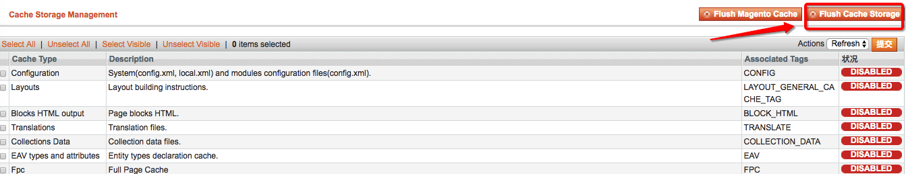

magento通过自带的升级脚本操作数据库，常见问题的解决方法如下

<!--more-->

## 对表的修改（增删改等）没有生效？
 - sql目录下是否有升级脚
 - 升级脚本是否正确（看Exception日志）
 - `config.xml`中有没有升级版本号
 - 有没有清magento的configration缓存
 - 如果安装了redis，有没有清redis缓存

## 升级脚本升级成功了怎么修改？
可能是想在升级脚本中对表插入一个叫`customer_name`的字段,不小心输入错误成了`customer_wrong_name`，然后提交了代码，脚本成功升级了,错误的字段也加上了，怎么修改呢？

两种解决方法：

 1. 再写一个升级脚本，修改表字段名称
 2. 直接修改升级脚本，`在core_resource`表中将模块的版本号修改为升级前的版本号，清除congfigration缓存后重新升级

 第一种方法适用于已经发布到线上的脚本
 第二种方法适用于本地开发，保证自己的代码都是正确的，没有修修补补的内容

## 表中新增字段成功了，但是对应的字段无法插入正确的值？
如果你是通过`$object->setData('a',123)->save();`这样的对象方法进行的数据库操作没有成功，试试下面的方法：

`System/Cache Management/Flush Cache Storage`

原理：Magento采用的是ORM模型，表的数据结构保存在DDL缓存里，对表的结构进行修改后要更新DDL缓存才能正确地进行值的插入
