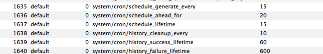

 - 设置magento后台配置
 - magento后台配置保存后触发的事件


<!--more-->

# magento的后台配置
以`Core`模块etc目录下的`system.xml`为例
``` xml app/code/core/Mage/Cron/etc/system.xml
<?xml version="1.0"?>
<config>
    <sections>
        <system>
            <groups>
                <cron translate="label comment" module="cron">
                    <label>Cron (Scheduled Tasks) - all the times are in minutes</label>
                    <frontend_type>text</frontend_type>
                    <sort_order>15</sort_order>
                    <show_in_default>1</show_in_default>
                    <show_in_website>0</show_in_website>
                    <show_in_store>0</show_in_store>
                    <comment>For correct URLs generated during cron runs please make sure that Web > Secure and Unsecure Base URLs are explicitly set.</comment>
                    <fields>
                        <schedule_generate_every translate="label">
                            <label>Generate Schedules Every</label>
                            <frontend_type>text</frontend_type>
                            <sort_order>10</sort_order>
                            <show_in_default>1</show_in_default>
                            <show_in_website>1</show_in_website>
                            <show_in_store>1</show_in_store>
                        </schedule_generate_every>
                        <!--...省略其它fileds...-->
                    </fields>
                </cron>
            </groups>
        </system>
    </sections>
</config>
```

### 配置文件
有`config - sections - groups - fields`四个层级
如上面的配置文件中，`sections`只有system一项，`groups` 只有cron一项，而`fileds`包括schedule_generate_every、schedule_lifetime、history_cleanup_every、history_success_lifetime、history_failure_lifetime

### 配置项

- label 显示的标签
- frontend_type 输入类型
	- text 文本框
- sort_order 排序 数值越大，排在越后面
- show_in_default 是否默认显示 1，是；0，否
- show_in_website 是否在网站显示 1，是；0，否
- show_in_store 是否在店铺显示 1，是；0，否
- comment 备注说明

### 配置文件合并
因为Magento在初始化的时候会将分散在所有模块中的system.xml文件合并成一个大的system.xml，所以sections、groups、fields的标签都要求是唯一的

### 配置项的数据存储
在`core_config_data`中可以看到配置保存的内容

如上图所示，表示cron模块在后台配置项的值
我们可以直接修改数据库中的内容，这和在mangento后台编辑并保存的最终效果是一样的，只是不会触发下面介绍的配置保存的事件

### 取配置项的值
还是上面数据库中的第四列表示配置项的路径，当我们要在代码中获取某个配置项，如`schedule_generate_every`的值的时候，可以用下面的方法

``` php app/Mage.php
public static function getStoreConfig($path, $store = null)
{
    return self::app()->getStore($store)->getConfig($path);
}
//example
Mage::getStoreConfig('system/cron/schedule_generate_every',Mage::app()->getStore());
```
如果配置项schedule_generate_every设置的frontend_type是boolean类型的话，那么最好用下面的方法取默认值

``` php app/Mage.php
public static function getStoreConfigFlag($path, $store = null)
{
    $flag = strtolower(self::getStoreConfig($path, $store));
    if (!empty($flag) && 'false' !== $flag) {
        return true;
    } else {
        return false;
    }
}
//example:
Mage::getStoreConfigFlag('system/cron/schedule_generate_every',Mage::app()->getStore());
```

`getStoreConfigFlag`会将配置的值转化为true或false后返回给你

### 设置配置项的默认值
前面提到了，我们建立了配置项之后，要么在后台设置它的值并保存，要么修改数据库

而当配置项需要在多个测试环境配置相同的值时，不管是上面的哪种方法，都挺烦人的，其实在建立配置项的同时就可以把默认值设置好了

系统自带的cron模块就采用了这种方法来设置默认值，在和system.xml同目录的config.xml中，有下面的代码：
``` xml app/code/core/Mage/Cron/etc/config.xml
<default>
    <system>
        <cron>
            <schedule_generate_every>15</schedule_generate_every>
            <schedule_ahead_for>20</schedule_ahead_for>
            <schedule_lifetime>15</schedule_lifetime>
            <history_cleanup_every>10</history_cleanup_every>
            <history_success_lifetime>60</history_success_lifetime>
            <history_failure_lifetime>600</history_failure_lifetime>
        </cron>
    </system>
</default>
```
默认值的目录和system.xml中的`config - sections - groups - fields`是完全一致的

设置默认值之后没有生效，你可能要注意的一点是：
>只有当默认值和配置项同时建立的时候，才能一次性的在magento后台展示出默认值。
>如果我们先建立的配置项，在后台看到的都是空白值之后才在`config.xml`中建立默认值并清除configration后，在magento看到的依然是空白
>我们可以尝试在magento后台重新保存一下配置

### 配置的缓存问题
修改了`congig.xml`和`system.xml`文件后，永远不要忘记清除configration缓存，才能使得修改生效

# magento后台配置修改后触发的事件
``` php app/code/core/Mage/Adminhtml/controllers/System/ConfigController.php
/**
 * Save configuration
 *
 */
public function saveAction()
{
    $session = Mage::getSingleton('adminhtml/session');
    /* @var $session Mage_Adminhtml_Model_Session */

    $groups = $this->getRequest()->getPost('groups');

    if (isset($_FILES['groups']['name']) && is_array($_FILES['groups']['name'])) {
        /**
         * Carefully merge $_FILES and $_POST information
         * None of '+=' or 'array_merge_recursive' can do this correct
         */
        foreach($_FILES['groups']['name'] as $groupName => $group) {
            if (is_array($group)) {
                foreach ($group['fields'] as $fieldName => $field) {
                    if (!empty($field['value'])) {
                        $groups[$groupName]['fields'][$fieldName] = array('value' => $field['value']);
                    }
                }
            }
        }
    }

    try {
        if (!$this->_isSectionAllowed($this->getRequest()->getParam('section'))) {
            throw new Exception(Mage::helper('adminhtml')->__('This section is not allowed.'));
        }

        // custom save logic
        $this->_saveSection();
        $section = $this->getRequest()->getParam('section');
        $website = $this->getRequest()->getParam('website');
        $store   = $this->getRequest()->getParam('store');
        Mage::getSingleton('adminhtml/config_data')
            ->setSection($section)
            ->setWebsite($website)
            ->setStore($store)
            ->setGroups($groups)
            ->save();

        // reinit configuration
        Mage::getConfig()->reinit();
        Mage::dispatchEvent('admin_system_config_section_save_after', array(
            'website' => $website,
            'store'   => $store,
            'section' => $section
        ));
        Mage::app()->reinitStores();

        // website and store codes can be used in event implementation, so set them as well
        Mage::dispatchEvent("admin_system_config_changed_section_{$section}",
            array('website' => $website, 'store' => $store)
        );
        $session->addSuccess(Mage::helper('adminhtml')->__('The configuration has been saved.'));
    }
    catch (Mage_Core_Exception $e) {
        foreach(explode("\n", $e->getMessage()) as $message) {
            $session->addError($message);
        }
    }
    catch (Exception $e) {
        $session->addException($e,
            Mage::helper('adminhtml')->__('An error occurred while saving this configuration:') . ' '
            . $e->getMessage());
    }

    $this->_saveState($this->getRequest()->getPost('config_state'));

    $this->_redirect('*/*/edit', array('_current' => array('section', 'website', 'store')));
}
```

保存configuration后

1. 触发`admin_system_config_section_save_after`事件，事件会带website、store、section参数
2. 稍后触发`admin_system_config_changed_section_{$section}`事件

当我们在后台修改cron的配置后，就会触发admin_system_config_changed_section_cron事件，在`config.xml`文件中监听这个事件，进行响应的逻辑处理

``` xml app/code/core/Mage/Cron/etc/config.xml
<config>
    <global>
        <events>
            <admin_system_config_changed_section_cataloginventory>
                <observers>
                    <cron>
                        <class>cron/observer</class>
                        <method>doSomethingAfterCronSave</method>
                    </cron>
                </observers>
            </admin_system_config_changed_section_cataloginventory>
        </events>
    </global>
</config>
```
然后就可以在`Cron/Model/Observers.php`文件的`doSomethingAfterCronSave`方法中执行你想要的操作了

