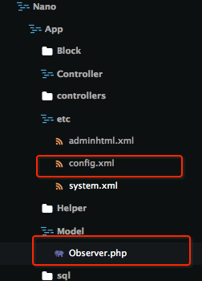

>与复写`controller`比较类似的功能,在`config.xml`的配置上有一些差异


以复写`Captcha`模块下的`Model`下的`Observer.php`为例:




<!--more-->

先在`Model`文件夹下新建`Nano_App_Model_Observer`类文件，继承原有的类`Mage_Captcha_Model_Observer`：

``` php app/code/local/Nano/App/Model/Observer.php
<?php
/**
 * Rewrite Captcha Observer because error message should be given when captcha is not correct
 */
class Nano_App_Model_Observer extends Mage_Captcha_Model_Observer
{
}
```

再修改`app`模块的配置文件`config.xml`,使得复写生效
``` xml app/code/local/Nano/App/etc/config.xml
<models>
    <nano_app>
        <class>Nano_App_Model</class>
    </nano_app>
    <captcha>
        <rewrite>
            <observer>Nano_App_Model_Observer</observer>
        </rewrite>
    </captcha>
</models>
```
