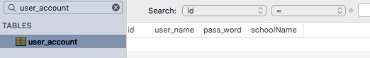

> 《深入理解Magento第四章 - 模型和ERM模型》指出，模型的使用分为四步：
1. 启用模型
2. 启用资源模型
3. 在资源模型中添加实体(Entity)。对于简单的模型来说,实体就是数据表的名字
4. 为资源模型设置读、写适配器

在`magento`中创建并使用一个记录用户信息的数据库


<!--more-->
# 代码框架


# 配置文件

> (1) 修改配置文件后需要清除`mageno`缓存方可生效
> (2) 读、写配置器可以不配置，`magento`会为没有适配器的资源模型启用默认的适配器，默认的适配器如下面的配置文件所示

``` xml magento-practise.local/app/code/local/Nano/App/etc/config.xml
<?xml version="1.0"?>
<config>
    <modules>
        <Nano_App>
            <version>0.0.1</version>    <!--配置文件的版本号，很重要，跟我们后面的数据库安装程序有关-->
        </Nano_App>
    </modules>
    <frontend>
        <routers>
            <Nano_App>
                <use>standard</use>
                <args>
                    <module>Nano_App</module>    <!--配置路由规则-->
                    <frontName>app</frontName>
                 </args>
            </Nano_App>
        </routers>
    </frontend>
<global>
        <helpers>
            <nano_app>
                <class>Nano_App_Helper</class>
            </nano_app>
        </helpers>
        <models>
          <app>     <!--模型类唯一标识-->
              <class>Nano_App_Model</class>    <!--指定模型类-->
              <resourceModel>app_mysql4</resourceModel> <!--指定资源模型类-->
          </app>
          <app_mysql4>    <!--资源模型唯一标识-->
              <class>Nano_App_Model_Resource_Mysql4</class>
              <entities>
                  <user>
                     <table>user_account</table>    <!--实体，指定数据库中的表名称-->
                  </user>
              </entities>
         </app_mysql4>
        </models>
        <resources>
          <app_setup>        <!--指定app模型的安装程序-->
            <setup>
              <module>Nano_App</module>
              <class>Nano_App_Model_Setup_Mysql4_Setup</class>
            </setup>
            <connection>
              <use>core_setup</use>
            </connection>
          </app_setup>
          <app_write>        <!-读配置器->
            <connection>
              <use>default_write</use>
            </connection>
          </app_write>
          <app_read>        <!--写配置器-->
            connection>
              <use>default_read</use>
            </connection>
          </app_read>
        </resources>
    </global>
```


# 数据库图形化界面

调试的时候如果不想在终端执行`sql`语句，可以使用数据库软件

在`mac`环境可以用`Sequel Pro`
`windows`环境可以用`Navicat`

# 创建mysql数据库 - 安装脚本
>为了便于理解`magento`中的`mysql`，我们这里直接用`magento`自带的方法安装数据库，不手动建立数据库了

如代码结构图所示，在sql目录下创`app_setup`目录，并新建`mysql4_install-0.0.1.php`
注意，安装程序的版本号需要和`config.xml`里的版本号保持一致
编辑如下：

``` php magento-practise.local/app/code/local/Nano/App/sql/app_setup/mysql4-install-0.1.0.php
<?php
$installer = $this;
$installer->startSetup();
$installer->run("
-- DROP TABLE IF EXISTS {$this->getTable('app/user')};
CREATE TABLE `{$this->getTable('app/user')}` (
  `id` int(11) unsigned NOT NULL AUTO_INCREMENT,
  `user_name` varchar(32) DEFAULT NULL,
  `pass_word` varchar(32) DEFAULT NULL,
  `schoolName` varchar(32) DEFAULT NULL,
  PRIMARY KEY (`id`)
) ENGINE=InnoDB AUTO_INCREMENT=1 DEFAULT CHARSET=utf8;
");
$installer->endSetup();
```

这时候，访问你的magento主页，当加载到`APP`模块的时候就会执行安装脚本，并创建一张名为`user_account`的表，表中有四个字段，自增的`id`，用户名`user_name`,密码`pass_word`,学校名称`schoolName`(这里用驼峰型后面要用）


>注1：从`app/user`到表`user_account`的过程如下：左边的`app`是模型名，右边的`user`是实体名，先寻找名为`app`的模型，再找它的默认资源模型：`app_mysql4`，资源模型下寻找名为`user`的实体，即为`user_account`

>注2：如果安装程序没有生效，查看`core_resource`表，找到名为`app_setup`的一项，删除该项，并清空magento的缓存，即可


# 创建模型

``` php magento-practise.local/app/code/local/Nano/App/Model/User.php
<?php
class Nano_App_Model_User extends Mage_Core_Model_Abstract
{
    public function _construct()
    {
        $this->_init('app/user');
    }
}
```

# 创建资源模型

> 模型类会自动调用资源模型类，资源模型类是与数据库进行对话的组件

``` php magento-practise.local/app/code/local/Nano/App/Model/Resource/Mysql4/User.php
<?php
class Nano_App_Model_Resource_Mysql4_User extends Mage_Core_Model_Mysql4_Abstract
{
    public function _construct()
    {
        $this->_init('app/user','id');
    }
}
```

# 创建模型集合
> 通过模型集合，可以同时操作多条记录

``` php magento-practise.local/app/code/local/Nano/App/Model/Resource/Mysql4/User/Collection.php
<?php
class Nano_App_Model_Resource_Mysql4_User_Collection extends Mage_Core_Model_Mysql4_Collection_Abstract
{
    public function _construct()
    {
        $this->_init('app/user');
    }
}
```


# 使用数据库
> 使用`get`, `set`, `unset`, `has`方法来进行进行数据的读取、写入、删除、判断是否存在
## 插入数据

``` php magento-practise.local/app/code/local/Nano/App/controllers/IndexController.php
public function insertAction()
    {
        $user = Mage::getModel("app/user");
        // $user->setId(1);        //我们已经设置了`id`字段为自增型，不用给它赋值
        $user->setUserName('mengmeng');
        $user->setPassWord('123');
        // $user->setSchoolName('seu');    //这句话向数据库中插入的字段是`school_name`
        $user->setData('schoolName','seu');    //如果要插入名字是驼峰型的字段，需要使用`setData`方法
        $user->save();
        echo 'saved!';
    }
```

> (1) 对于名称为下划线格式的字段，`setUserName('a')`等价于`setData('user_name','a')`
> (2) `setUserName`这样的方法之所以能生效，是因为使用了`__set()`魔术方法

调用`insert`接口：

查看数据库：


## 查询数据

``` php magento-practise.local/app/code/local/Nano/App/controllers/IndexController.php
public function selectAction()
    {
        $user = Mage::getModel("app/user");
        $user->load(1);
        echo $user->getUserName().'<br/>';
        echo $user->getData('schoolName').'<hr/>';      //同理，驼峰型的字段只能用`getData`方法取值
        echo 'selected!';
    }
```

调用`select`接口：


> `getUserName`这样的方法之所以能生效，是因为使用了`__get()`魔术方法

## 修改数据

``` php magento-practise.local/app/code/local/Nano/App/controllers/IndexController.php
public function updateAction()
    {
        $user = Mage::getModel("app/user");
        $user->load(1);
        $user->setUserName('xiamengmeng');
        $user->save();
        echo 'updated!';
    }
```
调用`update`接口：

查看数据库：


## 删除数据

``` php magento-practise.local/app/code/local/Nano/App/controllers/IndexController.php
public function delete()
    {
        $user = Mage::getModel("app/user");
        $user->load(1);
        $user->delete();
        echo 'deleted!';
    }
```
调用`delete`接口

查看数据库：



## 获取所有数据

``` php magento-practise.local/app/code/local/Nano/App/controllers/IndexController.php
public function collectAction()
    {
        $users = Mage::getModel("app/user")->getCollection();
        foreach($users as $user){
            echo $user->getId().':'.$user->getUserName()."<br/>";
        }
        echo '<hr/>'.'get all data!';
    }
```

先向数据库中插入几条数据

再调用`collect`接口


> 这里用到了前面创建的模型集合类

# 修改数据库 - 更新脚本
想要对已经创建的数据库进行修改，如增加字段，改变字段属性等，最简单粗暴的方式是直接修改安装脚本，然后在`core_resource`脚本中删除模块对应的`setup`,如`app_setup`,模块就会重新执行安装脚本

这种方法只适合本地调试用

线上有需要修改数据库的，应当使用更新脚本

我们之前创建的表`user_account`，我们要增加一个字段`age`

首先修改`config.xml`的版本号

``` xml magento-practise.local/app/code/local/Nano/App/etc/config.xml
<?xml version="1.0"?>
<config>
    <modules>
        <Nano_App>
            <version>0.0.2</version>    <!--当需要增加数据库安装脚本时，修改此处的版本号-->
        </Nano_App>
    </modules>
```
然后在`App`模块的`sql`文件夹下新建`mysql4-upgrade-0.0.1-0.0.2.php`，文件名表示你要从`0.0.1`版本升级到`0.0.2`版本

``` php magento-practise.local/app/code/local/Nano/App/sql/app_setup/mysql4-upgrade-0.0.1-0.0.2.php
<?php
$installer = $this;
$installer->startSetup();
$installer->run("
ALTER TABLE `{$this->getTable('app/user')}` ADD `age` INT(4) NOT NULL;
");
$installer->endSetup();
```
清除缓存后，访问你本地的`magento`网站

这时，查看数据库，发现`age`字段已经出现了


再查看`core_resource`表

`app`模块的版本号也已经成功升级到了`0.2.0`


# FAQ
>`core_resource`表中能找到模块的`setup`字段，但是数据库的表没有新建成功？

查看数据库安装脚本的版本号与`config.xml`头部的版本号是否一致
