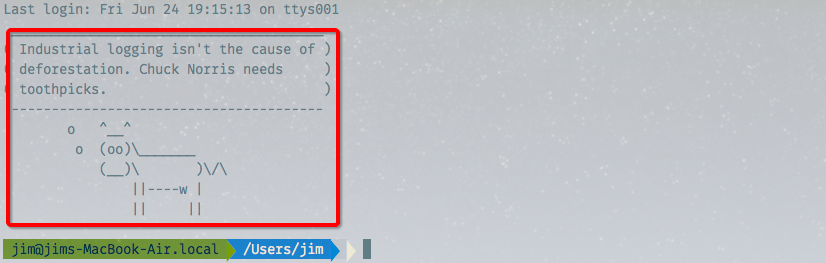

2018-10-16：虽然现在不用这个了，但是还是觉得很有趣

---


先上效果图，就是这只萌萌哒的小牛以及牛说的每日格言啦，怎么做出这种效果呢，往下看。



# 准备工作
假设你已经完成了下面的准备工作
> *安装了items2+zsh+oh my zsh(安装过程在这里不赘述了，网上一堆教程,推荐迟建强老师的教程：[终极 Shell](http://macshuo.com/?p=676))

> *安装了homebrew


# 开始安装zsh的欢迎界面

第一步，先用`homebrew`安装两个依赖的包

``` shell
brew install fortune
brew install cowsay
```

第二步，安装`oh my zsh`的`chucknorris`插件
打开终端配置文件

      vim ~/.zshrc

修改`plugins = ( )`这一行
括号里表示你安装过的插件，以空格区分，只要加上`chucknorris`就可以了，下面是我安装的所有的`oh my zsh`的插件，以供参考

``` shell
plugins=(brew git z extract history catimg wd last-working-dir chucknorris )
```
再在.zshrc文件的最后一行添一句命令：

`chuck_cow`
即可

保存并退出，重新加载配置文件

`source ~/.zshrc`

重启终端，牛牛就出来啦


enjoy it!
