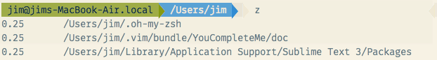
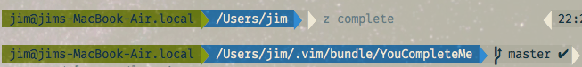
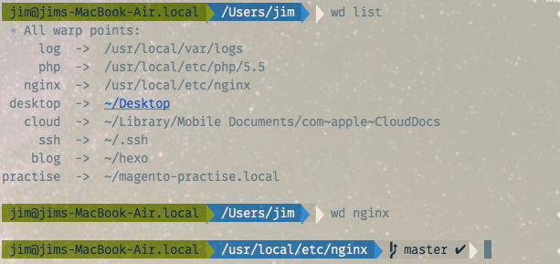

`zsh`的`z`插件可以随意跳转最近经常打开的文件夹
`zsh`的`wd`插件可以任意跳转你标记过的文件夹

<!--more-->

> 前提，你必须要先安装iTerm2和oh my zsh

试想一下这种场景：你想要修改nginx的配置，只知道大概在`/usr/local`目录下,不太清楚具体路径

你可能在终端这样输入：

``` shell
cd /usr
ll
cd local
ll
cd etc
ll
cd nginx
ll
vim nginx.conf
```

看完这篇文章的介绍，你的生活将发生翻天覆地的变化。

如果你的电脑安装了`iterm2`和`oh－my－zsh`，再安装`z`或`wd`插件之后
你只需要执行：

``` shell
z nginx
```

或

``` shell
wd nginx
```
就能一秒直达`nginx`目录

# 安装`z`和`wd`插件

安装zsh的插件
1. 打开用户目录下的`.zshrc`文件
2. 修改`.zshrc`文件,在plugins后面的括号中加入`z` `wd`，两个插件的功能是类似的，选择一个安装就可以了

```
plugins=(git z wd)
```

3. 保存并重新加载`.zshrc`文件


# 使用`z`插件

安装完`z`插件后

输入命令 `z` 即可查看你最近访问最频繁的目录


按`z`+目录名称的部分内容即可跳转目录



# 使用`wd`插件
常用命令：

``` shell
wd                  //查看所有可用命令
wd add (label_name) //标记目录
wd rm (label_name)  //去除目录标记
wd list             //查看所有标记
```

使用方法很简单
进入一个你觉得很常用的目录,如上面提到的`usr/local/etc/nginx`,执行`wd add nginx`,相当于告诉终端：我喜欢这个目录，帮我记住它，什么还要取个名字，那就叫`nginx`吧。以后在任何位置，你只需要执行`wd nginx`，就能直接返回这个目录了

示例：
