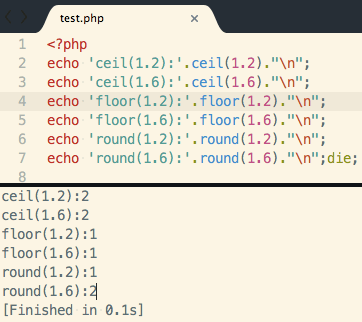

- ceil()     向上取整
- floor()    向下取整
- round()    四舍五入取整


<!--more-->


``` php test.php
<?php
echo 'ceil(1.2):'.ceil(1.2)."\n";
echo 'ceil(1.6):'.ceil(1.6)."\n";
echo 'floor(1.2):'.floor(1.2)."\n";
echo 'floor(1.6):'.floor(1.6)."\n";
echo 'round(1.2):'.round(1.2)."\n";
echo 'round(1.6):'.round(1.6)."\n";die;
```

运行结果如下：




