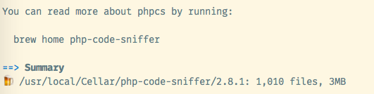
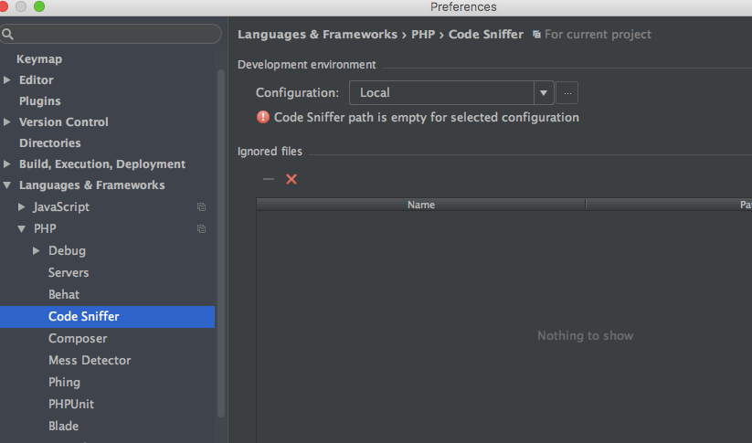
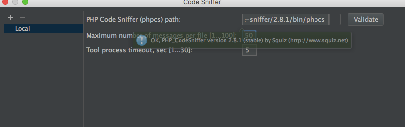
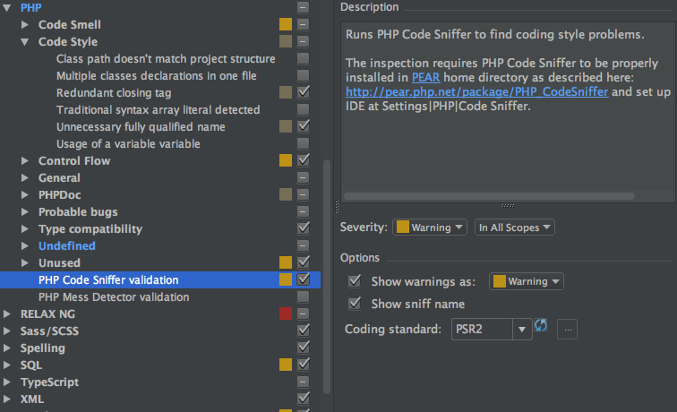

phpStorm支持psr的规范

<!--more-->

## 安装phpcs
```
brew install php-code-sniffer
```


那么安装完成后的路径就是：
`/usr/local/Cellar/php-code-sniffer/2.8.1/bin/phpcs`

## 在phpstorm设置phpcs
`Preferences/Languages & Frameworks/PHP/Code Sniffer`


选择之前phpcs的路径，填写后可以点击`Validate`按钮验证



## 在phpstorm设置psr提示
`Preferences/Editor/Inspections/PHP/PHP Code Sniffer validation`

修改`Severity`后的错误级别，默认是`Weak Warning`
点击`Coding standard`选项后的刷新按钮刷新列表，在列表中选择`PSR2`


