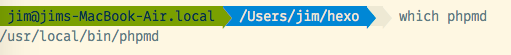
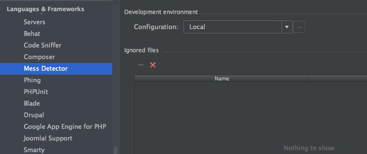
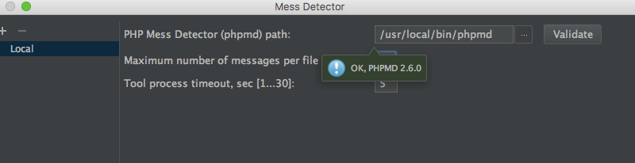
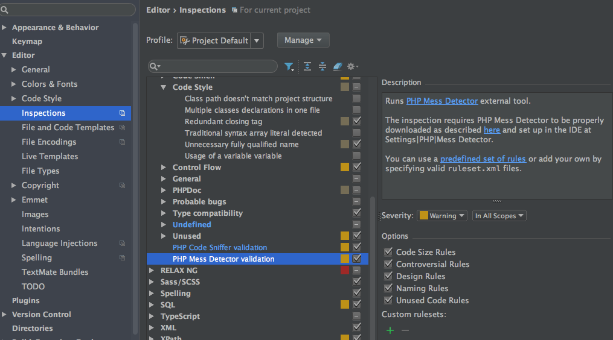
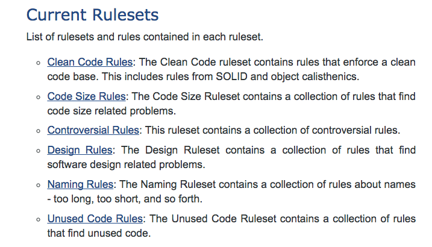
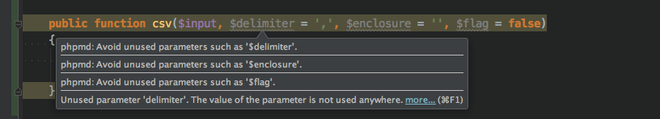

如果说phpcs规范了php代码的规范，那么phpmd就是aa检测php代码错误的利器


<!--more-->

## 什么是phpmd

>phpmd,short of PHP Mess Detector,is a tool that checks if you aren’t making a mess of your code. Think of methods of hundreds of lines, classes that extend class after class after class, lack of documentation, nested loops, etc. PHP Mess Detector points out these culprits and aids into writing more manageable code.


## 安装phpmd
```shell
brew install phpmd
```
安装之后查看phpmd的路径

路径就是`/usr/local/bin/phpmd`

## 配置phpmd
``Preferences/Languages & Frameworks/PHP/Mess Detector``

点开`Local`后的`...`,输入phpmd的路径`/usr/local/bin/phpmd`,点击`Validate`进行验证



`Preferences/Editor/Inspections/PHP/PHP Mess Detector validation`


勾选中`PHP Mess Detector validation`,并选择右侧建议的`Options`规则，规则的说明参考：[https://phpmd.org/rules/index.html](https://phpmd.org/rules/index.html)：


## 使用phpmd

