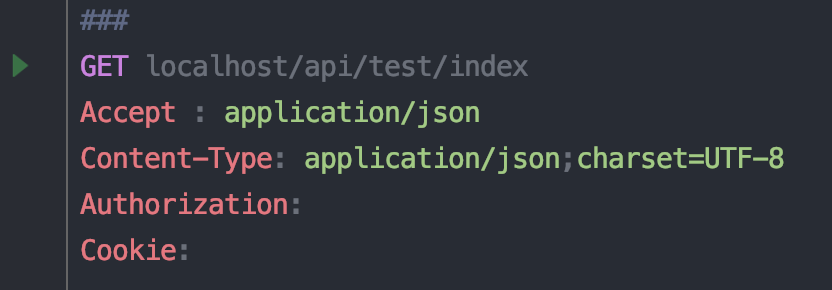

看了一篇文章[快速测试 API 接口的新技能](https://toutiao.io/k/6tokkp),说的是IDEA自带了Rest客户端，可以模拟接口请求
我就看看phpstorm能不能用的上

结果当然用的上啦n(*≧▽≦*)n

基本上，postman能实现的功能这里都可以搞定

<!--more-->

## 版本支持

新建了个.http文件，发现根本识别不了

丫的，原来我的正版phpstorm还是2017.3的版本，速度升级到最新版，然后就支持了，bingo!

## 建一个api试试

在新建的http文件中编辑如下一个api，注意起始一行一定要用`###`打头

```http
###
GET localhost/api/test/index
Accept : application/json
Content-Type: application/json;charset=UTF-8
Authorization:
Cookie:
```



点击api左边的绿色三角，就可以模拟这个api了

## post请求

```http
###
POST localhost/api/test/index
Accept : application/json
Content-Type: application/json;charset=UTF-8
Authorization:
Cookie:

{
"a":1,
"b":2,
"c":"hello world"
}
```


## 能不能支持xdebug呢？

google的app版本的Postman刚开始也支持不了xdebug，后来在同事的指点下，发现在cookie里加入以下内容就可以了

> XDEBUG_SESSION=PHPSTORM;


在这里应该也可以，编辑以下请求：

```http
### test
GET localhost/api/test/index
Accept : application/json
Content-Type: application/json;charset=UTF-8
Authorization:
Cookie: XDEBUG_SESSION=PHPSTORM
```
开启phpstorm的xdebug功能，果然成功了！


## 支持多环境

新建一个rest-client.env.json

```json
{
  "dev": {
      "host":"",
      "Accept":"application/json",
      "Content-Type":"application/json;charset=UTF-8",
      "Cookie":"XDEBUG_SESSION=PHPSTORM"
  },
  "test":{
      "host":"",
      "Accept":"",
      "Content-Type":"",
      "Cookie":""
  },
  "prod":{
      "host":"",
      "Accept":"",
      "Content-Type":"",
      "Cookie":""
  }
}
```

上面的api可以改写成：

```http
### test
GET {{host}}/api/test/index
Accept : {{Accept}}
Content-Type: {{Content_Type}}
Authorization:
Cookie: {{Cookie}}
```

此时，点运行的时候，就会让你选择环境来运行了。


