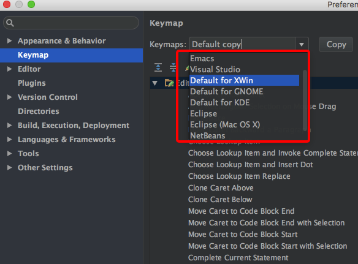

自定义phpstorm快捷键，类sublime风格

<!--more-->
# 将phpstorm快捷键设置为其它编辑器的
从以下编辑器切换到phpstorm的可以直接使用原先的快捷键：

# 自定义快捷键
直接搜索快捷键的关键字修改

## atom风格快捷键：

- 打开项目`Project`

>command+\

- 在项目中定位当前文件`Scroll From Source`(需要先安装Scorll From Source插件)

>command+shift+\

## sublime风格快捷键:

- 查找文件`Navigate-File`

>command+p

- 复制行 `Duplicate Line or Slection`

>command+shift+d

- 查找下一重复项 `Add Selection for Next Occurrence`

>command+d

- 查找所有重复项 `Select All Occurrences`

>command+ctrl+g

## vim风格快捷键
- 代码片段展开 `Expand Live Template / Emmet Abbreviation`

>ctrl+j

- 格式化代码 `Refomat Code`

> ctrl+alt+l

# phpstorm其它常用快捷键

- 查找并替换 `Edit - Find - Replace`

>command+r `Edit - Find - Find in Path`

- 全局搜索代码

>command+shift+f

- search everywhere

> shift+shift

- 查找用例

> alt+F7

- 重命名

> shift+F6 修改为F2

- 打开终端

> command + -

- 在Dash中查找

> alt+d
