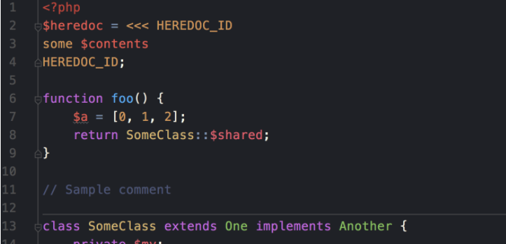

<!--more-->
1. 下载atom主题icls文件
https://github.com/jesusOmar/one-dark-phpstorm

2. 拷贝到`/Users/jim/Library/Preferences/PhpStorm2016.2/colors
`路径

3. 设置主题
`Editor/Colors & Fonts/`

webstorm也可以使用atom主题:
https://github.com/yurtaev/idea-one-dark-theme
