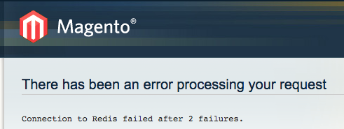

php常用的缓存工具：memcached和redis,本文讲的是在magento框架中借助magento的模块来使用redis

<!--more-->

## 准备工作
确保你的电脑安装并启动了redis服务、配置了php的redis扩展
## magento配置reids
1. 确保magento框架中安装并启用了`Cm_Cache_Backend_Redis`模块

2. 修改以下路径中的local配置文件
`项目根目录/app/etc/local.xml`
在`config/global`下添加子节点`cache`如下

``` xml
<cache>
  <backend>Cm_Cache_Backend_Redis</backend>
  <backend_options>
    <server>127.0.0.1</server> <!-- or absolute path to unix socket -->
    <port>6379</port>
    <persistent></persistent> <!-- Specify unique string to enable persistent connections. E.g.: sess-db0; bugs with phpredis and php-fpm are known: https://github.com/nicolasff/phpredis/issues/70 -->
    <database>0</database> <!-- Redis database number; protection against accidental data loss is improved by not sharing databases -->
    <password></password> <!-- Specify if your Redis server requires authentication -->
    <force_standalone>0</force_standalone>  <!-- 0 for phpredis, 1 for standalone PHP -->
    <connect_retries>1</connect_retries>    <!-- Reduces errors due to random connection failures; a value of 1 will not retry after the first failure -->
    <read_timeout>10</read_timeout>         <!-- Set read timeout duration; phpredis does not currently support setting read timeouts -->
    <automatic_cleaning_factor>0</automatic_cleaning_factor> <!-- Disabled by default -->
    <compress_data>1</compress_data>  <!-- 0-9 for compression level, recommended: 0 or 1 -->
    <compress_tags>1</compress_tags>  <!-- 0-9 for compression level, recommended: 0 or 1 -->
    <compress_threshold>20480</compress_threshold>  <!-- Strings below this size will not be compressed -->
    <compression_lib>gzip</compression_lib> <!-- Supports gzip, lzf, lz4 (as l4z) and snappy -->
    <use_lua>0</use_lua> <!-- Set to 1 if Lua scripts should be used for some operations -->
  </backend_options>
</cache>
```

3. 清空magento缓存使得配置文件生效，关于如何清空magento缓存，参考[《magento二次开发 - 如何清除magento缓存》](http://www.jianshu.com/p/a240602a4f36)

## 可能遇到的问题
- 6-22:今天上午打开本地网站时报如下错误`connection to Redis failed`：



发现是因为redis服务没有开启导致的，开启redis即可

***说明magento在配置了redis之后那么要保持reids服务一直处于开启状态***

参考：
[1]在magento中配置redis文档：
> http://devdocs.magento.com/guides/m1x/ce18-ee113/using_redis.html

[2]Cm_Cache_Backend_Redis配置
>https://github.com/colinmollenhour/Cm_Cache_Backend_Redis/blob/master/README.md


- 7-26:在`redis-cli`中执行`keys *`命令没有看到任何缓存信息

查看`local.xml`的配置：
``` xml
<session_save>db</session_save>
```
`session`存储的方式设置为`db`而不是`file`的时候，需要指定数据库的编号0-15,默认的数据库是1

可以用如下的命令打开`redis`客户端
``` shell
 redis-cli -n 1
```
也可以在客户端中选择数据库
``` shell
 redis-cli
 select 1
```


