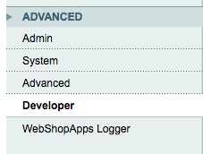
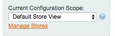
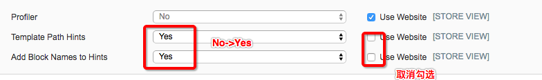
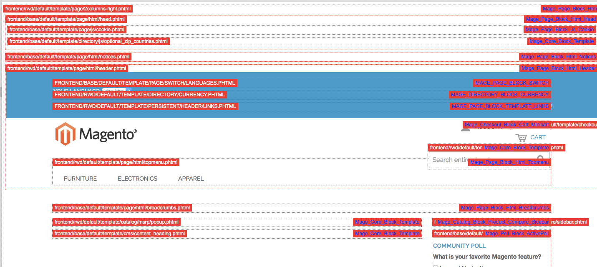

# 背景： 关于template和block
>Magento 的执行控制器不直接将数据传给试图,相反的视图将直接引用模型,从模型取数据。这样的设计就导致了视图被拆分成两 部 分,块(Block)和模板(Template)。块是 PHP 对象,而模板是原始 PHP 文件,混合了 XHTML 和 PHP 代码(也就是把 PHP 作为模板语言 来使用了)。每 一个块都和一个唯一的模板文件绑定。在模板文件 phtml 中,“$this”就是指 该模板文件对应的块对象。
 ​                                   -引用自《深入理解magento第三章》

# 方法一：直接在项目中搜索模板中的关键字
直接在代码库中搜索前台出现的关键字，如登陆页面的“用户名”、“密码”；首页的的“联系我们”之类的
缺点是可能会搜索到很多相关的文件，需要仔细的甄别

# 方法二： ［推荐］修改后台配置，直接在前台看到模板的名称
打开后台`你的magento网址/admin`选择：
`System - Configuration`
再选择`ADVANCED`下的`Developer`，如图

先在左上角选择`Default Store View`，如图

再修改右边的`Debug`模块，如图

然后在前台就会显示对应的`template`和`block`了
效果图：

# 方法三：安装开发者插件（不可用）
> 注：从水水的博客看到的方法，见
http://blog.csdn.net/shuishui8310/article/details/5223383

安装要用的key:   **magento-community/HM_DeveloperToolbar**
