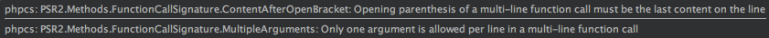

给phpStorm安装phpcs之后，碰到的psr问题都记录下来

<!--more-->

- A file SHOULD declare new symbols (classes, functions, constants, etc.) and cause no other side effects, or it SHOULD execute logic with side effects, but SHOULD NOT do both.

PHP代码中应该只定义类、函数、常量等声明，或其他会产生 从属效应 的操作（如：生成文件输出以及修改.ini配置文件等），二者只能选其一；

- The closing brace for the class must go on the next line after the body

 类的开始花括号({)必须写在函数声明后自成一行，结束花括号(})也必须写在函数主体后自成一行


```php
<?php

class Text
{
    public function test()
    {
        test;
    }
}//正确
```

```php
<?php

class Text
{
    public function test()
    {
        test;
    }

}//错误,类的结束花括号应该紧邻body
```


-  Each class must be in a namespace of at least one level(a top-level vendor name)

根据规范，每个类都独立为一个文件，且命名空间至少有一个层次：顶级的组织名称（vendor name）

```php
//正确写法
<?php
// PHP 5.3及以后版本的写法
namespace Vendor\Model;

class Foo
{
}
```

```php
//错误写法
<?php

class Foo
{
}
```

- Class name "A_B_C_D" is not in camel caps format

类的命名要遵循大写开头的驼峰命名规范

- 参数以分布在多行，随后的行应该缩进一次。如果这么做，第一项应该 在下一行，而且每一个参数独占一行；


```php
//错误
$className->funcName($param1, $param2, $param3mayhaveaveryverylongnamelongerthen120words);

```


```php
//正确
$className-> funcName(
                        $param1,
                        $param2,
                        $param3mayhaveaveryverylongnamelongerthen120words
                    );
```
