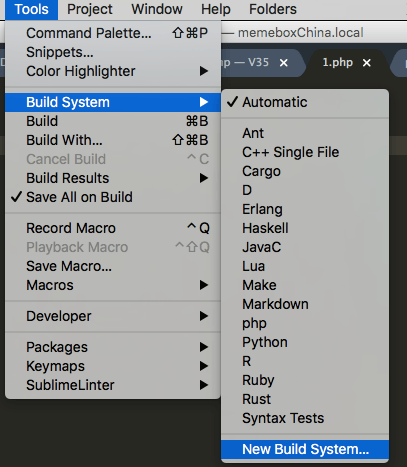
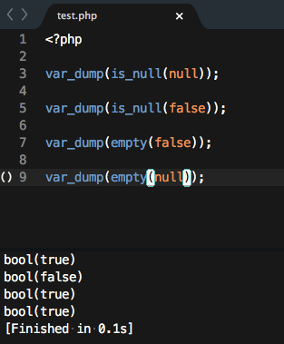

> 有时候在写`php`代码的时候，需要写一些短小的脚本测试，比如`empty()`,`is_null()`函数碰到`null`、`false`、`0`等变量时的结果

> 这些脚本可能就两三句话，想要运行的话，比较麻烦,幸好`sublime`自带的编译环境也支持php,不过需要我们进行一些配置


先确认你的`php`已经加入了环境变量

<!--more-->

选择`Tools`>`Build System`>`New Build System`



在弹出的文件中添加如下内容：

``` sublime-build /Users/jim/Library/Application Support/Sublime Text 3/Packages/User/php.sublime-build
{
    "cmd": ["php", "$file"],
    "file_regex": "php$",
    "selector": "source.php"
}
```

保存并命名为`php.sublime-build`

新建一个测试的`php`文件,输入以下内容，按`Command`+`B`即可编译



