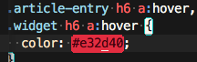
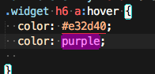
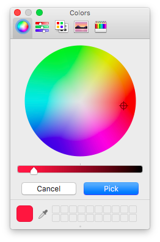

>安装过程略，在`package control`里直接搜索插件名称就可以了

# css颜色高亮插件 - Color Highlighter

如图所示，将鼠标放在css颜色的值上时，会自动显示对应的颜色,如下图所示

<!--more-->

# css取色器 - ColorPicker

将光标置于想要输入颜色的位置，打开`sublime`的控制台，输入`color picker`召唤出取色器，选择你想要的颜色，点击`pick`（也可以设置快捷键）

