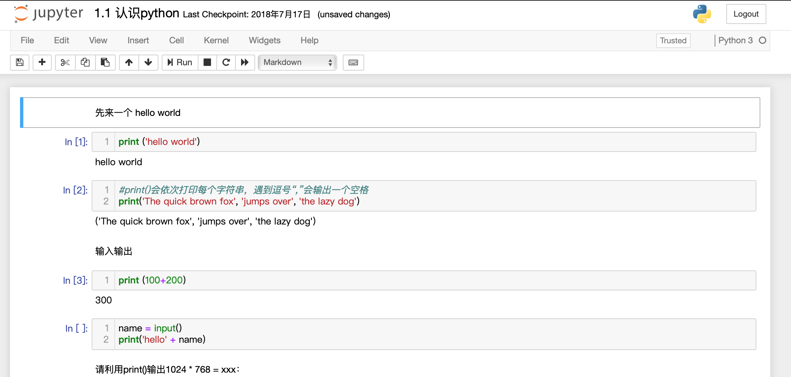

之前一直是通过brew安装python的，后面发现有一种更简便的方法，如下:

通过miniconda安装python和jupyter

然后通过jupyter notebook学习python知识

<!--more-->

## 安装conda、python和jupyter

[点击进入miniconda下载页面](https://conda.io/miniconda.html)

下载miniconda之后，通过`conda`命令来安装python和jupyter

```shel
conda install python
conda install jupyter
```

查看是否安装成功

```shell
➜  ~ conda list|grep python
condaipython                   6.5.0                    py36_0
ipython_genutils          0.2.0            py36h241746c_0
python                    3.6.5                hc167b69_1
python-dateutil           2.7.3                    py36_0
python.app                2                        py36_8
➜  ~ conda list | grep jupyter
jupyter                   1.0.0                    py36_4
jupyter_client            5.2.3                    py36_0
jupyter_console           5.2.0                    py36_1
jupyter_core
```

安装成功了


## 使用jupyter

在终端输入以下命令启动

```
jupyter notebook
```

启动过程：

```shell
➜  ~ jupyter notebook
[W 22:27:59.899 NotebookApp] WARNING: The notebook server is listening on all IP addresses and not using encryption. This is not recommended.
[I 22:27:59.919 NotebookApp] Serving notebooks from local directory: /Users/jimxu/jupyter
[I 22:27:59.919 NotebookApp] 0 active kernels
[I 22:27:59.919 NotebookApp] The Jupyter Notebook is running at:
[I 22:27:59.919 NotebookApp] http://192.168.1.11:8888/
[I 22:27:59.919 NotebookApp] Use Control-C to stop this server and shut down all kernels (twice to skip confirmation).
```


会直接通过默认浏览器打开本地jupyter服务器页面


`jupyter notebook`中默认的文件格式是`ipynb`

刚进入的时候应该只有一个类似helloworld.ipynb的文件,上图中的文件都是我自己新建的

## 认识ipynb文件

打开一个ipynb文件，如下图所示



文档内容以cell的格式展示，你可以选择cell的样式，jupyter提供以下样式

- Markdown
- Code
- Raw NBConvert
- Heading
- ...

其中，以Markdown和Code的cell最常用

如果只是这样的话，jupyter只能算是个高级的markdown笔记本了

最神奇的是，**你可以直接在文档中运行cell里的python代码**


## jupyter的配置


jupyter的配置文件是`~/.jupyter/jupyter_notebook_config.py`


