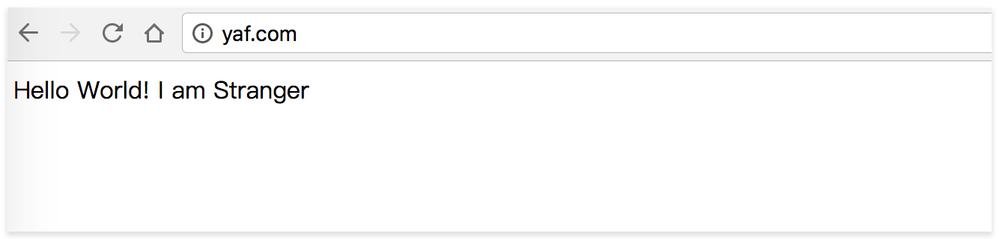

> 基于macos系统，PHP版本7.0.19

## yaf介绍

Yaf = yet another framework

鸟哥用C语言编写的一个PHP扩展，致力于解决`框架影响性能`这一经典问题


> Yaf框架 = 最不像框架的框架 = 对高性能有要求时选择


<!--more-->

## 安装yaf扩展

```shell
brew install php70-yaf --build-from-source
```
根据自己的php版本下载对应的扩展，如你的版本是php5.6那么就通过brew下载php56-yaf

在终端运行`php -m`,能看到yaf，说明扩展安装成功（或打印phpinfo()）

```shell
➜  ~ php -m | grep yaf
yaf
```


## 建立demo项目
用yaf的代码生成器cg快速生成一个demo project

```shell
下载https://github.com/laruence/yaf后解压
cd tools
cd cg
php yaf_cg test
cd output
cp -R test ~/test
```

## 设置虚拟主机
 - 修改server_name域名，root项目根目录

```conf
server {
        listen       80;
        server_name  yaf.com;

        location / {
            root   ~/test;
            index  index.html index.htm index.php;
            try_files $uri $uri/  /index.php;
        }

        error_page  404              /404.html;

        error_page   500 502 503 504  /50x.html;
        location = /50x.html {
            root   ~/test;
        }

        location ~ \.php {
            root ~/test;
            fastcgi_pass   127.0.0.1:9000;
            fastcgi_index  index.php;
            fastcgi_param  SCRIPT_FILENAME  $document_root$fastcgi_script_name;
            include        fastcgi_params;
        }
}
```

- 修改hosts文件，加入下面的内容

```
127.0.0.1  yaf.com
```
这样就可以通过访问域名`yaf.com`访问到demo项目了

## 测试

访问`yaf.com`,能看到`Hello World! I am Stranger`，说明安装配置成功


