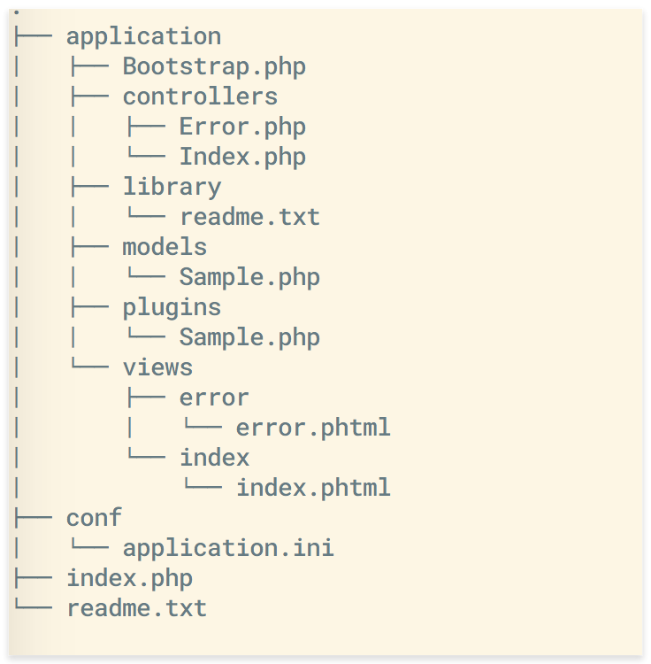

## 框架文件目录
以刚刚通过gc生成的demo项目为例，我们在终端执行`tree`命令,可以看到项目的目录结果如下所示：

> 注：tree命令不是自带的，有需要可以通过`brew install tree`安装

<!--more-->

./index.php	是项目的入口文件，也可以新建一个public文件夹，将index.php放到public目录下，同时修改nginx配置

./conf	是配置项
./conf/application.ini	项目的配置文件

./application
./application/Bootstrap.php	启动文件，主要用于初始化操作，如初始化设置、注册插件、加载全局基础类库等
./application/controllers	控制器
./application/library	类库
./application/models	模型
./application/plugins	插件
./application/views	   视图
